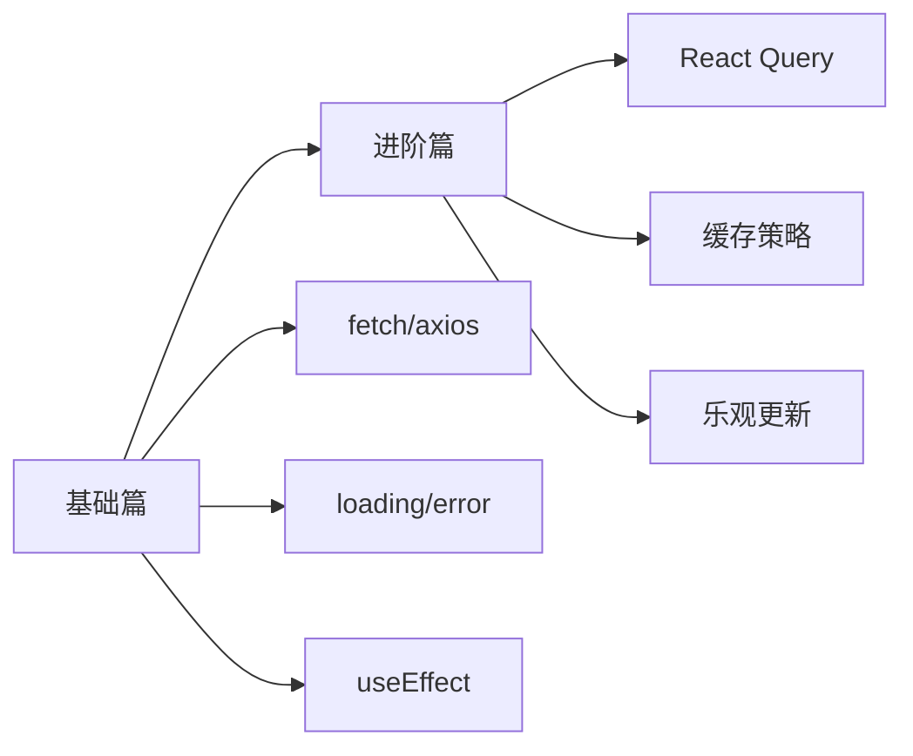
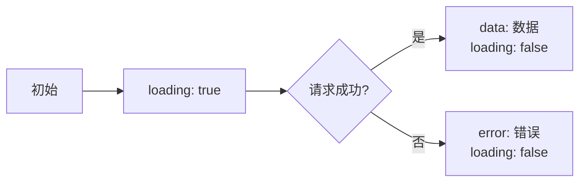

# 数据请求

## 快速了解

**数据请求是什么？**

数据请求是指在 React 应用中从服务器获取数据（如用户信息、文章列表、商品数据等），并在组件中显示。

**什么时候需要数据请求？**

- 需要显示服务器的数据（用户列表、文章列表）
- 需要提交数据到服务器（登录、注册、发表评论）
- 需要实时更新数据（聊天、通知）

**典型使用场景**

```
获取用户列表并显示
提交表单数据到服务器
搜索功能（输入关键词，请求搜索结果）
分页加载（滚动到底部加载更多）
实时数据更新（WebSocket）
```

## 学习路线



## 文档导航

### [1-基础篇](./1-基础篇.md)
- 数据请求是什么
- 使用 fetch 和 axios
- 处理 loading 和 error 状态
- 在 useEffect 中请求数据
- 完整示例

### [2-进阶篇](./2-进阶篇.md)
- React Query / SWR
- 缓存和重新验证
- 乐观更新
- 无限滚动
- 最佳实践

## 核心概念

| 概念 | 说明 | 示例 |
|-----|------|------|
| **fetch** | 浏览器原生 API | `fetch('/api/users')` |
| **axios** | 第三方请求库 | `axios.get('/api/users')` |
| **loading** | 加载状态 | 显示加载指示器 |
| **error** | 错误状态 | 显示错误信息 |
| **React Query** | 数据请求库 | 自动缓存、重试、刷新 |

## 快速开始

### 基本数据请求

```typescript
import { useState, useEffect } from 'react'

interface User {
  id: string
  name: string
  email: string
}

function UserList() {
  const [users, setUsers] = useState<User[]>([])
  const [loading, setLoading] = useState(true)
  const [error, setError] = useState<Error | null>(null)

  useEffect(() => {
    fetch('/api/users')
      .then(res => res.json())
      .then(data => {
        setUsers(data)
        setLoading(false)
      })
      .catch(err => {
        setError(err)
        setLoading(false)
      })
  }, [])

  if (loading) return <div>加载中...</div>
  if (error) return <div>错误: {error.message}</div>

  return (
    <ul>
      {users.map(user => (
        <li key={user.id}>{user.name}</li>
      ))}
    </ul>
  )
}
```

## 请求方式对比

### fetch vs axios

| 特性 | fetch | axios |
|-----|-------|-------|
| **原生支持** | 是 | 否（需要安装） |
| **自动转 JSON** | 否（需要手动 `.json()`） | 是 |
| **错误处理** | 只有网络错误才 reject | HTTP 错误也会 reject |
| **请求取消** | 支持（AbortController） | 支持（CancelToken） |
| **拦截器** | 不支持 | 支持 |
| **超时设置** | 不支持 | 支持 |

### 基本用法对比

```typescript
// fetch
fetch('/api/users')
  .then(res => {
    if (!res.ok) throw new Error('请求失败')
    return res.json()
  })
  .then(data => console.log(data))
  .catch(err => console.error(err))

// axios
axios.get('/api/users')
  .then(res => console.log(res.data))
  .catch(err => console.error(err))
```

## 数据请求库对比

| 特性 | 原生 fetch/axios | React Query | SWR |
|-----|-----------------|-------------|-----|
| **学习成本** | 低 | 中 | 中 |
| **自动缓存** | 否 | 是 | 是 |
| **自动重试** | 否 | 是 | 是 |
| **自动刷新** | 否 | 是 | 是 |
| **乐观更新** | 手动实现 | 内置 | 内置 |
| **适用场景** | 简单请求 | 复杂应用 | 中小型应用 |

## 常见数据请求模式

### 1. 列表数据

```typescript
function UserList() {
  const [users, setUsers] = useState<User[]>([])
  const [loading, setLoading] = useState(true)

  useEffect(() => {
    fetchUsers().then(data => {
      setUsers(data)
      setLoading(false)
    })
  }, [])

  return loading ? <Loading /> : <List data={users} />
}
```

### 2. 详情数据（带参数）

```typescript
function UserDetail({ userId }: { userId: string }) {
  const [user, setUser] = useState<User | null>(null)

  useEffect(() => {
    fetchUser(userId).then(setUser)
  }, [userId])

  return user ? <UserCard user={user} /> : <Loading />
}
```

### 3. 搜索数据（带查询参数）

```typescript
function SearchResults({ keyword }: { keyword: string }) {
  const [results, setResults] = useState([])

  useEffect(() => {
    if (!keyword) return

    search(keyword).then(setResults)
  }, [keyword])

  return <ResultList results={results} />
}
```

### 4. 提交数据（POST）

```typescript
function CreateUser() {
  const [loading, setLoading] = useState(false)

  const handleSubmit = async (data: UserData) => {
    setLoading(true)
    try {
      await createUser(data)
      alert('创建成功')
    } catch (error) {
      alert('创建失败')
    } finally {
      setLoading(false)
    }
  }

  return <UserForm onSubmit={handleSubmit} loading={loading} />
}
```

## 状态管理

### 三种状态

```typescript
const [data, setData] = useState(null)        // 数据
const [loading, setLoading] = useState(true)  // 加载中
const [error, setError] = useState(null)      // 错误
```

### 状态流转



## 最佳实践预览

1. **统一错误处理**：创建请求拦截器
2. **取消请求**：组件卸载时取消未完成的请求
3. **防抖/节流**：搜索等场景避免频繁请求
4. **缓存策略**：避免重复请求相同数据
5. **乐观更新**：提交数据时先更新 UI，提升体验

---

_建议先学习基础篇，掌握基本的数据请求方式，再学习进阶篇了解 React Query 等高级工具。_
