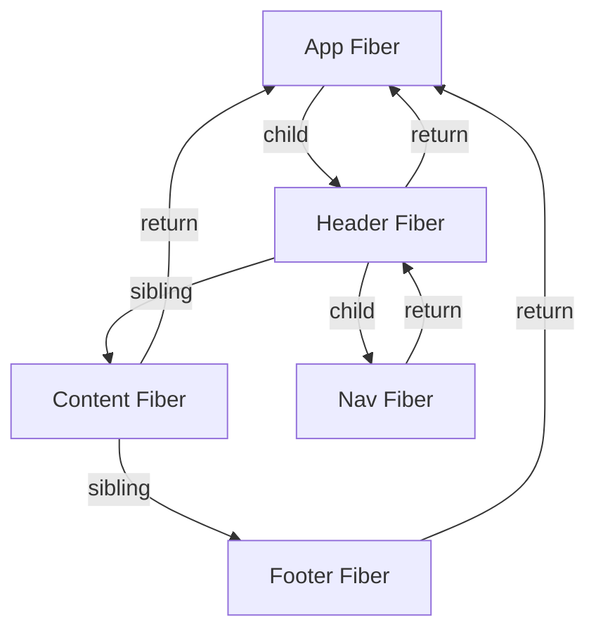
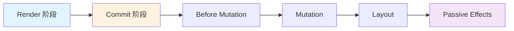
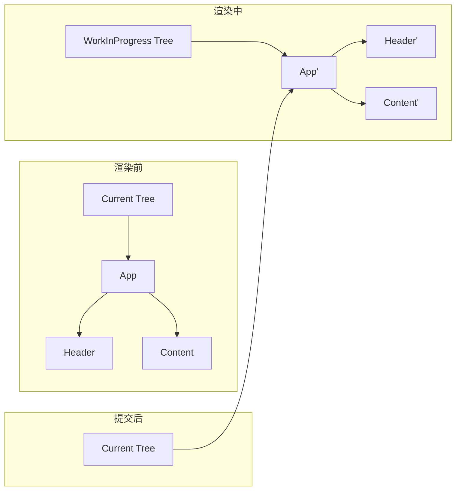
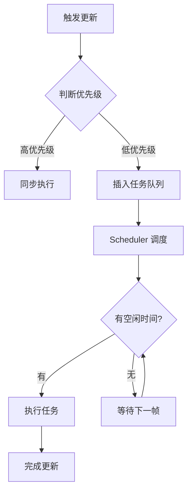
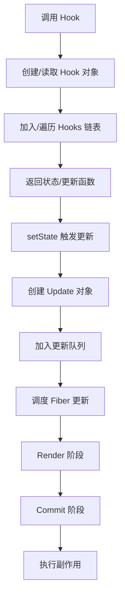

# React Hooks 源码篇

> 深入理解 Hooks 的实现原理、Fiber 架构和 React 18 并发特性。

---

## 一、Hooks 的设计哲学

### 1.1 为什么引入 Hooks？

React 团队在设计 Hooks 前，遇到了三大痛点：

#### 痛点一：逻辑复用困难

**类组件时代的方案**：
- **高阶组件（HOC）**：嵌套地狱（Wrapper Hell）
- **Render Props**：代码冗余、难以理解

```typescript
// HOC 嵌套地狱
export default withRouter(
  withAuth(
    withTheme(
      withData(MyComponent)
    )
  )
);

// Render Props 冗余
<ThemeContext.Consumer>
  {theme => (
    <AuthContext.Consumer>
      {auth => (
        <DataContext.Consumer>
          {data => <MyComponent theme={theme} auth={auth} data={data} />}
        </DataContext.Consumer>
      )}
    </AuthContext.Consumer>
  )}
</ThemeContext.Consumer>
```

**Hooks 的解决方案**：
```typescript
function MyComponent() {
  const theme = useTheme();
  const auth = useAuth();
  const data = useData();

  // 简洁清晰
}
```

#### 痛点二：复杂组件难以理解

**类组件的问题**：生命周期方法里混杂了不相关的逻辑。

```typescript
class ChatRoom extends React.Component {
  componentDidMount() {
    // 逻辑 A：订阅聊天
    this.subscription = chatAPI.subscribe(this.props.roomId);

    // 逻辑 B：获取用户数据
    fetchUser(this.props.userId);

    // 逻辑 C：添加事件监听
    window.addEventListener('resize', this.handleResize);
  }

  componentDidUpdate(prevProps) {
    // 逻辑 A：重新订阅
    if (prevProps.roomId !== this.props.roomId) {
      this.subscription.unsubscribe();
      this.subscription = chatAPI.subscribe(this.props.roomId);
    }

    // 逻辑 B：重新获取数据
    if (prevProps.userId !== this.props.userId) {
      fetchUser(this.props.userId);
    }
  }

  componentWillUnmount() {
    // 逻辑 A：取消订阅
    this.subscription.unsubscribe();

    // 逻辑 C：移除监听
    window.removeEventListener('resize', this.handleResize);
  }
}
```

**Hooks 的改进**：按逻辑分组，而不是按生命周期。

```typescript
function ChatRoom({ roomId, userId }) {
  // 逻辑 A：聊天订阅
  useEffect(() => {
    const subscription = chatAPI.subscribe(roomId);
    return () => subscription.unsubscribe();
  }, [roomId]);

  // 逻辑 B：用户数据
  useEffect(() => {
    fetchUser(userId);
  }, [userId]);

  // 逻辑 C：窗口监听
  useEffect(() => {
    const handleResize = () => { /* ... */ };
    window.addEventListener('resize', handleResize);
    return () => window.removeEventListener('resize', handleResize);
  }, []);

  // 相关逻辑聚在一起，清晰！
}
```

#### 痛点三：Class 的学习成本

- `this` 绑定问题
- 生命周期方法难以理解
- 代码压缩困难（Class 方法名不能压缩）

**Hooks 的优势**：
- 无需理解 `this`
- 函数组件更易压缩和优化

### 1.2 Hooks 的设计原则

#### 原则一：只在顶层调用 Hooks

**为什么？** 保证 Hooks 的调用顺序一致。

```typescript
// React 内部伪代码（简化版）
let currentFiber = null; // 当前组件的 Fiber 节点
let hookIndex = 0; // 当前 Hook 的索引

function useState(initialValue) {
  const hook = currentFiber.hooks[hookIndex]; // 按顺序读取
  hookIndex++;

  if (!hook) {
    // 首次渲染：创建 Hook
    currentFiber.hooks.push({
      state: initialValue,
      setState: (newValue) => {
        hook.state = newValue;
        scheduleUpdate(currentFiber);
      }
    });
  }

  return [hook.state, hook.setState];
}
```

**如果在条件里调用会怎样？**

```typescript
function Bad({ condition }) {
  if (condition) {
    useState(0); // Hook 1（有时调用，有时不调用）
  }
  useState(''); // Hook 2 或 Hook 1（索引乱了）
  useEffect(() => {}); // Hook 3 或 Hook 2（索引又乱了）
}

// 第一次渲染（condition = true）：
// hookIndex: 0 -> useState(0)
// hookIndex: 1 -> useState('')
// hookIndex: 2 -> useEffect

// 第二次渲染（condition = false）：
// hookIndex: 0 -> useState('') ❌ 读到了 useState(0) 的数据
// hookIndex: 1 -> useEffect    ❌ 读到了 useState('') 的数据
```

#### 原则二：只在 React 函数中调用

**为什么？** React 需要管理 Hook 的状态（通过 Fiber 节点）。

---

## 二、Hooks 的底层实现

### 2.1 Fiber 架构简介

**什么是 Fiber？**
Fiber 是 React 16 引入的新协调引擎，每个组件对应一个 Fiber 节点。

```typescript
// Fiber 节点的简化结构
type Fiber = {
  type: any; // 组件类型（函数/类/DOM 标签）
  props: any; // 组件 props
  stateNode: any; // 实际的 DOM 节点或组件实例

  // Fiber 树的指针
  return: Fiber | null; // 父节点
  child: Fiber | null; // 第一个子节点
  sibling: Fiber | null; // 下一个兄弟节点

  // Hooks 链表
  memoizedState: Hook | null; // 第一个 Hook

  // 其他字段...
};

// Hook 的结构
type Hook = {
  memoizedState: any; // Hook 的状态（如 useState 的值）
  next: Hook | null; // 下一个 Hook

  // useState 专用
  queue: UpdateQueue | null; // 更新队列

  // useEffect 专用
  create: () => (() => void) | void; // 副作用函数
  destroy: (() => void) | void; // 清理函数
  deps: any[] | null; // 依赖数组
};
```

**Fiber 树的遍历**：



### 2.2 useState 的实现原理

#### 挂载阶段（mountState）

```typescript
// React 内部伪代码（简化版）
function mountState<S>(initialState: S): [S, Dispatch<S>] {
  // 1. 创建 Hook 对象
  const hook: Hook = {
    memoizedState: initialState, // 存储当前状态
    queue: null, // 更新队列（后面用）
    next: null // 指向下一个 Hook
  };

  // 2. 把 Hook 加到链表末尾
  if (workInProgressHook === null) {
    // 第一个 Hook
    currentlyRenderingFiber.memoizedState = workInProgressHook = hook;
  } else {
    // 后续 Hook
    workInProgressHook = workInProgressHook.next = hook;
  }

  // 3. 创建 dispatch 函数
  const dispatch = dispatchSetState.bind(null, currentlyRenderingFiber, hook);

  return [hook.memoizedState, dispatch];
}
```

**Hooks 链表示例**：

```typescript
function Counter() {
  const [count, setCount] = useState(0);     // Hook 1
  const [name, setName] = useState('Tom');   // Hook 2
  const [list, setList] = useState([]);      // Hook 3

  // Fiber.memoizedState -> Hook1 -> Hook2 -> Hook3 -> null
}
```

#### 更新阶段（updateState）

```typescript
function updateState<S>(): [S, Dispatch<S>] {
  // 1. 读取当前 Hook（按顺序）
  const hook = updateWorkInProgressHook();

  // 2. 处理更新队列（如果有多次 setState）
  const queue = hook.queue;
  let newState = hook.memoizedState;

  if (queue.pending !== null) {
    // 遍历更新队列
    const firstUpdate = queue.pending.next;
    let update = firstUpdate;

    do {
      // 计算新状态
      if (typeof update.action === 'function') {
        newState = update.action(newState); // 函数式更新
      } else {
        newState = update.action; // 直接传值
      }

      update = update.next;
    } while (update !== firstUpdate);

    // 清空队列
    queue.pending = null;
  }

  // 3. 更新状态
  hook.memoizedState = newState;

  const dispatch = dispatchSetState.bind(null, currentlyRenderingFiber, hook);
  return [newState, dispatch];
}
```

#### setState 的执行过程

```typescript
function dispatchSetState<S>(
  fiber: Fiber,
  hook: Hook,
  action: S | ((prevState: S) => S)
) {
  // 1. 创建更新对象
  const update: Update<S> = {
    action,
    next: null
  };

  // 2. 加入更新队列（环形链表）
  const queue = hook.queue;
  if (queue.pending === null) {
    // 第一个更新：自己指向自己
    update.next = update;
  } else {
    // 后续更新：插入队列
    update.next = queue.pending.next;
    queue.pending.next = update;
  }
  queue.pending = update;

  // 3. 调度更新
  scheduleUpdateOnFiber(fiber);
}
```

**批量更新的原理**：

```typescript
function handleClick() {
  setCount(count + 1); // 创建 update1
  setCount(count + 1); // 创建 update2
  setCount(count + 1); // 创建 update3

  // 三个 update 都加入队列，但只触发一次调度
}

// 更新队列（环形链表）：
// update3 -> update1 -> update2 -> update3
//   ↑                                ↓
//   ←--------------------------------←
```

**为什么连续 setState 只会 +1？**

```typescript
setCount(count + 1); // action = 0 + 1 = 1
setCount(count + 1); // action = 0 + 1 = 1（闭包，count 还是 0）
setCount(count + 1); // action = 0 + 1 = 1

// 最终 count = 1
```

**函数式更新如何解决？**

```typescript
setCount(c => c + 1); // action = (0) => 1
setCount(c => c + 1); // action = (1) => 2
setCount(c => c + 1); // action = (2) => 3

// 最终 count = 3
```

### 2.3 useEffect 的实现原理

#### 挂载阶段（mountEffect）

```typescript
function mountEffect(
  create: () => (() => void) | void,
  deps: any[] | null
) {
  // 1. 创建 Hook
  const hook: Hook = {
    memoizedState: {
      create,      // 副作用函数
      destroy: undefined, // 清理函数（还没执行）
      deps,        // 依赖数组
      next: null   // 下一个 Effect
    },
    next: null
  };

  // 2. 加入链表
  // ...

  // 3. 标记副作用（在 commit 阶段执行）
  currentlyRenderingFiber.flags |= PassiveEffect;
}
```

#### 更新阶段（updateEffect）

```typescript
function updateEffect(
  create: () => (() => void) | void,
  deps: any[] | null
) {
  const hook = updateWorkInProgressHook();
  const prevEffect = hook.memoizedState;

  // 比较依赖
  if (deps !== null) {
    const prevDeps = prevEffect.deps;

    // 依赖没变：跳过执行
    if (areHookInputsEqual(deps, prevDeps)) {
      hook.memoizedState = {
        create,
        destroy: prevEffect.destroy, // 保留旧的清理函数
        deps,
        next: null
      };
      return;
    }
  }

  // 依赖变了：标记需要执行
  currentlyRenderingFiber.flags |= PassiveEffect;

  hook.memoizedState = {
    create,
    destroy: undefined, // 清理函数会在执行 create 后更新
    deps,
    next: null
  };
}
```

#### 依赖比较算法

```typescript
function areHookInputsEqual(
  nextDeps: any[],
  prevDeps: any[] | null
): boolean {
  if (prevDeps === null) return false;

  // 逐个比较（使用 Object.is）
  for (let i = 0; i < prevDeps.length && i < nextDeps.length; i++) {
    if (Object.is(nextDeps[i], prevDeps[i])) {
      continue;
    }
    return false;
  }

  return true;
}

// Object.is 和 === 的区别
Object.is(NaN, NaN); // true（=== 是 false）
Object.is(+0, -0);   // false（=== 是 true）
Object.is({}, {});   // false（引用不同）
```

#### Effect 的执行时机

**React 的渲染流程**：



| 阶段 | 时机 | 执行的 Hooks |
|------|------|--------------|
| **Render** | 调用组件函数 | 所有 Hooks（但不执行副作用） |
| **Before Mutation** | DOM 更新前 | - |
| **Mutation** | 更新 DOM | - |
| **Layout** | DOM 更新后（同步） | `useLayoutEffect` |
| **Passive Effects** | 浏览器绘制后（异步） | `useEffect` |

**useEffect vs useLayoutEffect**：

```typescript
useEffect(() => {
  console.log('在浏览器绘制后执行（异步）');
  // 适合：数据请求、订阅、日志等
});

useLayoutEffect(() => {
  console.log('在 DOM 更新后、浏览器绘制前执行（同步）');
  // 适合：测量 DOM、同步 DOM 更新
});
```

**执行顺序示例**：

```typescript
function App() {
  console.log('1. Render');

  useEffect(() => {
    console.log('3. useEffect 执行');
  });

  return <div ref={() => console.log('2. DOM 更新完成')}>Hello</div>;
}

// 输出顺序：
// 1. Render
// 2. DOM 更新完成
// 3. useEffect 执行
```

### 2.4 useRef 的实现原理

```typescript
function mountRef<T>(initialValue: T): { current: T } {
  const hook: Hook = {
    memoizedState: { current: initialValue }, // 直接存对象
    next: null
  };

  // 加入链表...

  return hook.memoizedState;
}

function updateRef<T>(): { current: T } {
  const hook = updateWorkInProgressHook();
  return hook.memoizedState; // 返回同一个对象引用
}
```

**为什么修改 ref.current 不触发渲染？**
因为 React 不会追踪 `ref.current` 的变化，只在组件函数执行时读取 Hook 的状态。

---

## 三、Fiber 架构与调度

### 3.1 为什么需要 Fiber？

**React 15 的问题**：递归更新，无法中断。

```typescript
// React 15 的 reconcile（简化版）
function reconcile(element, parentDOM) {
  // 创建/更新 DOM
  const dom = createOrUpdateDOM(element);

  // 递归处理子节点
  element.children.forEach(child => {
    reconcile(child, dom); // 无法中断，长列表会卡顿
  });

  // 挂载到父节点
  parentDOM.appendChild(dom);
}
```

**Fiber 的改进**：把递归改成循环 + 链表，可以中断。

```typescript
// Fiber 的 reconcile（简化版）
function workLoop(deadline) {
  let shouldYield = false;

  while (nextUnitOfWork && !shouldYield) {
    nextUnitOfWork = performUnitOfWork(nextUnitOfWork);
    shouldYield = deadline.timeRemaining() < 1; // 时间不够就暂停
  }

  if (nextUnitOfWork) {
    // 还有任务，继续调度
    requestIdleCallback(workLoop);
  } else {
    // 任务完成，提交更新
    commitRoot();
  }
}

requestIdleCallback(workLoop);
```

### 3.2 Fiber 的双缓冲机制

React 维护**两棵 Fiber 树**：

```typescript
type RootFiber = {
  current: Fiber; // 当前显示的树
  workInProgress: Fiber; // 正在构建的树
};

// 更新流程：
// 1. 基于 current 树创建 workInProgress 树
// 2. 在 workInProgress 树上计算变化
// 3. 完成后，切换 current 指针
```

**为什么要双缓冲？**
- 在内存中构建新树，不影响当前显示
- 计算可以被中断和恢复
- 完成后一次性提交，避免闪烁



### 3.3 React 的两阶段更新

#### Render 阶段（可中断）

```typescript
function performUnitOfWork(fiber: Fiber): Fiber | null {
  // 1. beginWork：处理当前节点
  if (fiber.child) {
    return fiber.child; // 深度优先：先处理子节点
  }

  // 2. completeWork：完成当前节点
  let nextFiber = fiber;
  while (nextFiber) {
    if (nextFiber.sibling) {
      return nextFiber.sibling; // 有兄弟节点，处理兄弟
    }
    nextFiber = nextFiber.return; // 回到父节点
  }

  return null; // 遍历完成
}
```

**Render 阶段做什么？**
- 调用组件函数，执行 Hooks
- 创建/更新 Fiber 节点
- 标记需要更新的节点（flags）
- **不操作 DOM**

#### Commit 阶段（不可中断）

```typescript
function commitRoot(root: FiberRoot) {
  // 1. Before Mutation：DOM 更新前
  commitBeforeMutationEffects(root);

  // 2. Mutation：更新 DOM
  commitMutationEffects(root);

  // 3. Layout：DOM 更新后（同步）
  commitLayoutEffects(root);

  // 4. Passive Effects：异步执行 useEffect
  scheduleCallback(commitPassiveEffects, root);
}
```

**Commit 阶段做什么？**
- 操作 DOM（增删改）
- 执行 `useLayoutEffect`
- 异步执行 `useEffect`

### 3.4 优先级调度

React 18 引入了**车道模型（Lanes）**，不同更新有不同优先级。

```typescript
// 优先级（从高到低）
const SyncLane = 0b0000000000000000000000000000001; // 同步（如 onClick）
const InputContinuousLane = 0b0000000000000000000000000000100; // 连续输入
const DefaultLane = 0b0000000000000000000000000010000; // 默认
const TransitionLane = 0b0000000000000000000001000000000; // Transition
const IdleLane = 0b0100000000000000000000000000000; // 空闲

// 示例：
onClick={() => {
  setCount(count + 1); // SyncLane：立即执行

  startTransition(() => {
    setList(hugeList); // TransitionLane：可被打断
  });
}
```

**调度流程**：



---

## 四、React 18 并发特性

### 4.1 并发渲染的核心概念

**传统渲染**：一旦开始，必须完成整个更新。

```
用户输入 -> [渲染 10000 个组件] -> 页面更新（卡顿 2 秒）
```

**并发渲染**：高优先级更新可以打断低优先级更新。

```
用户输入 -> [渲染输入框] -> 页面更新（立即响应）
         ↓
      [渲染列表的一部分]
         ↓
      [继续渲染列表...]
```

### 4.2 useTransition 的实现原理

```typescript
function useTransition(): [boolean, (callback: () => void) => void] {
  const [isPending, setIsPending] = useState(false);

  const startTransition = useCallback((callback: () => void) => {
    setIsPending(true);

    // 设置当前更新为 Transition 优先级
    const prevTransition = ReactCurrentBatchConfig.transition;
    ReactCurrentBatchConfig.transition = 1;

    try {
      setIsPending(false); // 高优先级
      callback(); // callback 里的 setState 是低优先级
    } finally {
      ReactCurrentBatchConfig.transition = prevTransition;
    }
  }, []);

  return [isPending, startTransition];
}
```

**执行流程**：

```typescript
const [isPending, startTransition] = useTransition();

const handleChange = (e) => {
  const newQuery = e.target.value;
  setQuery(newQuery); // 高优先级：立即更新

  startTransition(() => {
    setResults(filterHugeList(newQuery)); // 低优先级：可被打断
  });
};

// 执行顺序：
// 1. setQuery 触发高优先级更新 -> 输入框立即响应
// 2. startTransition 里的 setResults 触发低优先级更新 -> 可以被打断
// 3. 如果用户继续输入，低优先级更新会被丢弃，重新开始
```

### 4.3 useDeferredValue 的实现原理

```typescript
function useDeferredValue<T>(value: T): T {
  const [prevValue, setPrevValue] = useState(value);

  useEffect(() => {
    // 用 Transition 优先级更新
    startTransition(() => {
      setPrevValue(value);
    });
  }, [value]);

  return prevValue;
}
```

**对比 useTransition**：

```typescript
// useTransition：主动标记更新
const [isPending, startTransition] = useTransition();
startTransition(() => {
  setState(newValue); // 这个更新是低优先级
});

// useDeferredValue：被动获取延迟的值
const deferredValue = useDeferredValue(value);
// value 变化时，deferredValue 会"延迟"跟上（用 Transition 优先级）
```

### 4.4 Suspense 的实现原理

**基本用法**：

```typescript
<Suspense fallback={<Loading />}>
  <LazyComponent /> {/* 懒加载组件 */}
</Suspense>
```

**原理**：组件 throw 一个 Promise，React 捕获并显示 fallback。

```typescript
// 懒加载组件的实现（简化版）
function lazy<T>(loader: () => Promise<{ default: T }>) {
  let status = 'pending';
  let result: T;

  const suspender = loader().then(
    module => {
      status = 'success';
      result = module.default;
    },
    error => {
      status = 'error';
      result = error;
    }
  );

  return function LazyComponent(props: any) {
    if (status === 'pending') {
      throw suspender; // 抛出 Promise
    }
    if (status === 'error') {
      throw result;
    }
    return <result {...props} />;
  };
}
```

**Suspense 的捕获机制**：

```typescript
// React 内部伪代码
function renderComponent(Component, props) {
  try {
    return <Component {...props} />;
  } catch (promise) {
    if (promise instanceof Promise) {
      // 捕获到 Promise，显示 fallback
      promise.then(() => {
        // Promise 完成后重新渲染
        scheduleUpdate();
      });
      return <Fallback />;
    }
    throw promise;
  }
}
```

---

## 五、Hooks 的进阶原理

### 5.1 为什么闭包会"过时"？

```typescript
function Counter() {
  const [count, setCount] = useState(0);

  useEffect(() => {
    const timer = setInterval(() => {
      console.log(count); // ❌ 永远打印 0
    }, 1000);

    return () => clearInterval(timer);
  }, []); // 依赖为空

  return <button onClick={() => setCount(count + 1)}>{count}</button>;
}
```

**原理**：每次渲染都是一个独立的函数调用，有独立的闭包。

```typescript
// 第一次渲染（count = 0）
function Counter() {
  const count = 0; // 闭包捕获 0

  useEffect(() => {
    const timer = setInterval(() => {
      console.log(count); // 闭包里的 count 是 0
    }, 1000);
    return () => clearInterval(timer);
  }, []);
}

// 第二次渲染（count = 1）
function Counter() {
  const count = 1; // 新的闭包捕获 1

  // 但 useEffect 依赖为空，不会重新执行
  // 所以定时器里还是旧的闭包（count = 0）
}
```

**解决方案**：

```typescript
// 方案一：添加依赖（但会导致定时器重建）
useEffect(() => {
  const timer = setInterval(() => {
    console.log(count); // 总是最新的 count
  }, 1000);
  return () => clearInterval(timer);
}, [count]); // 加上依赖

// 方案二：函数式更新（推荐）
useEffect(() => {
  const timer = setInterval(() => {
    setCount(c => {
      console.log(c); // 总是最新的
      return c;
    });
  }, 1000);
  return () => clearInterval(timer);
}, []); // 依赖为空

// 方案三：用 ref
const countRef = useRef(count);
useEffect(() => {
  countRef.current = count; // 同步最新值
}, [count]);

useEffect(() => {
  const timer = setInterval(() => {
    console.log(countRef.current); // 总是最新的
  }, 1000);
  return () => clearInterval(timer);
}, []);
```

### 5.2 为什么 setState 是异步的？

**原因一：批量更新（性能优化）**

```typescript
function handleClick() {
  setCount(count + 1); // 不立即更新
  setName('Tom');      // 不立即更新
  setAge(18);          // 不立即更新

  // 三次 setState 合并成一次渲染
}
```

**原因二：保证内部一致性**

```typescript
function Parent() {
  const [count, setCount] = useState(0);

  return (
    <Child count={count} onClick={() => setCount(count + 1)} />
  );
}

function Child({ count, onClick }) {
  useEffect(() => {
    console.log('count 变成了', count);
  }, [count]);

  return <button onClick={onClick}>{count}</button>;
}

// 如果 setState 是同步的：
// 1. 点击按钮
// 2. setCount 同步更新 count（但 Child 还没重新渲染）
// 3. Child 的 useEffect 看到的 count 和 props.count 不一致 ❌
```

**原因三：支持并发特性**

如果 setState 是同步的，就无法实现可中断的更新。

### 5.3 为什么需要依赖数组？

**问题**：如果没有依赖数组，怎么知道何时重新执行副作用？

```typescript
// 假设没有依赖数组
useEffect(() => {
  fetchUser(userId);
});

// 两种极端：
// 1. 每次渲染都执行 -> 性能差、可能无限循环
// 2. 只执行一次 -> userId 变化时不会重新请求
```

**依赖数组的作用**：明确告诉 React「这个副作用依赖哪些值」。

```typescript
useEffect(() => {
  fetchUser(userId);
}, [userId]); // 只在 userId 变化时重新执行
```

**React 如何检查依赖？**
用 `Object.is` 浅比较。

```typescript
// 引用类型：比较引用
const obj1 = { id: 1 };
const obj2 = { id: 1 };
Object.is(obj1, obj2); // false（引用不同）

const obj3 = obj1;
Object.is(obj1, obj3); // true（引用相同）
```

---

## 六、性能优化原理

### 6.1 React.memo 的实现

```typescript
function memo<P>(
  Component: React.FC<P>,
  compare?: (prevProps: P, nextProps: P) => boolean
) {
  return function MemoizedComponent(props: P) {
    const prevProps = useRef<P>();

    // 首次渲染
    if (!prevProps.current) {
      prevProps.current = props;
      return <Component {...props} />;
    }

    // 比较 props
    const shouldUpdate = compare
      ? !compare(prevProps.current, props) // 自定义比较
      : !shallowEqual(prevProps.current, props); // 浅比较

    if (shouldUpdate) {
      prevProps.current = props;
      return <Component {...props} />;
    }

    // props 没变，返回上次的结果（跳过渲染）
    return useMemo(() => <Component {...prevProps.current!} />, []);
  };
}

// 浅比较
function shallowEqual(obj1: any, obj2: any): boolean {
  if (Object.is(obj1, obj2)) return true;

  const keys1 = Object.keys(obj1);
  const keys2 = Object.keys(obj2);

  if (keys1.length !== keys2.length) return false;

  for (let key of keys1) {
    if (!Object.is(obj1[key], obj2[key])) return false;
  }

  return true;
}
```

### 6.2 useMemo / useCallback 的实现

```typescript
function useMemo<T>(create: () => T, deps: any[]): T {
  const hook = updateWorkInProgressHook();
  const prevDeps = hook.memoizedState[1];

  // 首次渲染 或 依赖变了
  if (!prevDeps || !areHookInputsEqual(deps, prevDeps)) {
    const value = create(); // 重新计算
    hook.memoizedState = [value, deps];
    return value;
  }

  // 依赖没变，返回缓存的值
  return hook.memoizedState[0];
}

function useCallback<T extends Function>(callback: T, deps: any[]): T {
  // 等价于 useMemo(() => callback, deps)
  return useMemo(() => callback, deps);
}
```

**为什么不默认缓存所有值？**
- 缓存本身有开销（存储、比较）
- 简单计算不需要缓存
- 过度缓存反而更慢

---

## 七、调试技巧

### 7.1 React DevTools

**查看 Hooks 状态**：

```
Components 面板 -> 选中组件 -> 右侧查看 Hooks
```

**查看渲染次数**：

```
Profiler 面板 -> 录制 -> 查看每个组件的渲染次数和时间
```

### 7.2 打印渲染原因

```typescript
function useWhyDidYouUpdate(name: string, props: any) {
  const prevProps = useRef<any>();

  useEffect(() => {
    if (prevProps.current) {
      const changed = Object.keys(props).filter(
        key => !Object.is(prevProps.current[key], props[key])
      );

      if (changed.length > 0) {
        console.log(`[${name}] 重新渲染，原因:`);
        changed.forEach(key => {
          console.log(`  ${key}:`, prevProps.current[key], '->', props[key]);
        });
      }
    }

    prevProps.current = props;
  });
}

// 使用
function MyComponent({ userId, name }) {
  useWhyDidYouUpdate('MyComponent', { userId, name });
  // ...
}
```

### 7.3 检查闭包陷阱

```typescript
function useCheckClosure() {
  const renderCountRef = useRef(0);
  renderCountRef.current++;

  const check = (name: string, value: any) => {
    console.log(
      `[${name}] 渲染次数: ${renderCountRef.current}, 值: ${value}`
    );
  };

  return check;
}

// 使用
function Counter() {
  const [count, setCount] = useState(0);
  const check = useCheckClosure();

  useEffect(() => {
    const timer = setInterval(() => {
      check('定时器里的 count', count);
    }, 1000);
    return () => clearInterval(timer);
  }, []);

  return <button onClick={() => setCount(count + 1)}>{count}</button>;
}
```

---

## 八、面试检验题

### 题目 1：说说 Fiber 架构解决了什么问题？

**答案要点**：
1. **问题**：React 15 递归更新无法中断，长列表会卡顿
2. **解决**：
   - 把递归改成循环 + 链表
   - 把更新拆成小任务（时间切片）
   - 可以暂停、恢复、丢弃任务
3. **实现**：双缓冲机制 + 优先级调度

### 题目 2：为什么 Hooks 不能写在条件判断里？

**答案要点**：
1. **原因**：React 通过调用顺序识别每个 Hook
2. **实现**：内部用链表存储 Hooks，按顺序读取
3. **后果**：条件调用会导致顺序不一致，状态错乱
4. **正确做法**：Hooks 写在顶层,条件逻辑写在 Hook 内部

### 题目 3：setState 为什么是异步的？

**答案要点**：
1. **批量更新**：多次 setState 合并成一次渲染（性能优化）
2. **内部一致性**：保证 props 和 state 同步更新
3. **支持并发**：异步才能实现可中断的更新

### 题目 4：useEffect 和 useLayoutEffect 的区别？

**答案要点**：
1. **执行时机**：
   - `useEffect`：浏览器绘制后（异步）
   - `useLayoutEffect`：DOM 更新后、浏览器绘制前（同步）
2. **使用场景**：
   - `useEffect`：数据请求、订阅、日志（大部分情况）
   - `useLayoutEffect`：测量 DOM、同步 DOM 更新（避免闪烁）
3. **性能**：`useLayoutEffect` 会阻塞渲染，尽量少用

### 题目 5：React 18 的并发特性是什么？

**答案要点**：
1. **核心**：高优先级更新可以打断低优先级更新
2. **API**：
   - `useTransition`：主动标记低优先级更新
   - `useDeferredValue`：被动获取延迟的值
   - `Suspense`：异步组件加载
3. **效果**：保持 UI 响应，避免卡顿

---

## 总结

### Hooks 原理总览



### 关键概念

| 概念 | 作用 |
|------|------|
| **Fiber** | 可中断的更新单元，链表结构 |
| **双缓冲** | current 和 workInProgress 两棵树 |
| **Hooks 链表** | 按顺序存储组件的 Hooks |
| **更新队列** | 批量处理多次 setState |
| **优先级调度** | 高优先级更新先执行 |
| **并发渲染** | 可中断、可恢复的更新 |

### 学习建议

1. **先用起来**：基础篇和进阶篇的实践更重要
2. **理解核心**：Fiber、链表、批量更新
3. **深入源码**（可选）：阅读 React 源码（`react-reconciler` 包）

---

_本文档持续更新，添加更多原理分析和源码解读_
