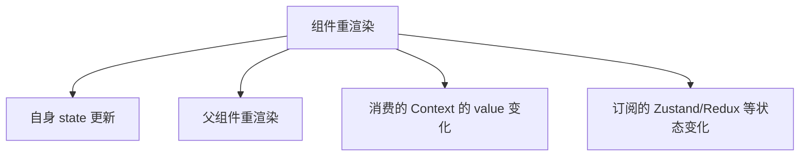

# 性能优化 · 基础篇

> 何时会重渲染、key 的正确用法、React.memo / useMemo / useCallback

---

## 一、何时会重渲染？

### 定义

**重渲染（Re-render）** 指 React 再次执行函数组件、得到新的虚拟 DOM，再与上次结果做 Diff，必要时更新真实 DOM。

### 会触发重渲染的情况



| 原因 | 说明 |
|------|------|
| **自身 state 更新** | 调用了本组件的 `setState`（或等价更新） |
| **父组件重渲染** | 默认情况下，父组件一渲染，所有子组件都会跟着渲染（不论 props 是否变化） |
| **Context 变化** | 组件用了 `useContext`，该 Context 的 Provider 的 value 变了 |
| **Store 订阅变化** | 用 Zustand/Redux 等时，你「订阅」的那部分状态变了 |

### 通俗理解

可以把组件想成「接到通知就重新算一遍」：
- 自己的数据变了 → 要重新算
- 爸爸重新算了一遍 → 默认带着孩子一起算
- 用的「共享数据」（Context、store）变了 → 要重新算

**重要**：重渲染不等于「DOM 一定更新」。React 会先 Diff，只有真正变化的部分才会改 DOM。但函数会重新执行，若内部有重计算或子组件很多，仍可能卡顿。

### 如何验证重渲染？

- 在组件里加 `console.log('XXX 渲染')`，看谁在什么时候打印
- 用 **React DevTools** 的 **Profiler** 录制交互，看哪些组件渲染了、耗时多少

---

## 二、key 的作用与正确用法

### 为什么需要 key？

列表渲染时，React 需要区分「哪一项是之前的 A、哪一项是新的 B」。**key** 用来唯一标识列表中的每一项，方便 Diff 时复用 DOM、减少不必要的销毁和创建。

### 基本用法

```typescript
interface User {
  id: string
  name: string
}

function UserList({ users }: { users: User[] }) {
  return (
    <ul>
      {users.map((user) => (
        <li key={user.id}>{user.name}</li>
      ))}
    </ul>
  )
}
```

**原则**：key 要在**同一列表内唯一且稳定**。同一项在不同渲染中最好对应同一个 key。

### 为什么不要用 index 做 key？

当列表会**增删、排序、过滤**时，每一项的 index 会变，React 会误以为「还是同一项」，导致：
- 状态错位（例如输入框内容跟错人）
- 多余的重渲染或错误的复用

```typescript
// ❌ 不好：删掉中间一项后，后面项的 index 全变，key 全对不上
{items.map((item, index) => (
  <Item key={index} item={item} />
))}

// ✅ 好：用唯一 id
{items.map((item) => (
  <Item key={item.id} item={item} />
))}
```

**例外**：列表**只追加、不删不改不排序**时，用 index 问题不大，但用 id 更稳妥。

---

## 三、React.memo：减少子组件无效重渲染

### 什么时候用？

**父组件经常重渲染，但传给子组件的 props 大多没变**时，用 `React.memo` 包住子组件，React 会对 props 做**浅比较**，没变就不重渲染子组件。

### 基本用法

```typescript
import { memo } from 'react'

interface ChildProps {
  name: string
}

const Child = memo(function Child({ name }: ChildProps) {
  console.log('Child 渲染')
  return <div>{name}</div>
})

function Parent() {
  const [count, setCount] = useState(0)
  return (
    <div>
      <button onClick={() => setCount(count + 1)}>计数: {count}</button>
      <Child name="Tom" />
      {/* count 变时 Parent 渲染，但 name 没变，Child 不渲染 */}
    </div>
  )
}
```

**默认行为**：对 props 做**浅比较**（类似 `Object.is`）。若需要自定义，可以传第二个参数：

```typescript
const Child = memo(Component, (prevProps, nextProps) => {
  // 返回 true 表示「认为相等」，不重渲染
  return prevProps.id === nextProps.id
})
```

### 常见问题：memo 了为什么还是总渲染？

**原因**：父组件传的是**每次渲染都新建的对象或函数**，引用变了，浅比较认为 props 变了，于是子组件还是会渲染。

```typescript
const Child = memo(({ data, onClick }: { data: { value: number }; onClick: () => void }) => {
  console.log('Child 渲染')
  return <button onClick={onClick}>{data.value}</button>
})

function Parent() {
  const [count, setCount] = useState(0)
  // ❌ 每次渲染都是新对象、新函数，Child 每次都会渲染
  const data = { value: 100 }
  const handleClick = () => console.log('点击')

  return (
    <div>
      <button onClick={() => setCount(count + 1)}>计数: {count}</button>
      <Child data={data} onClick={handleClick} />
    </div>
  )
}
```

**解决**：用 `useMemo` 稳定对象引用、用 `useCallback` 稳定函数引用（见下节）。
**结论**：`React.memo` 要配合稳定的 props（基本类型或 useMemo/useCallback 的返回值）才有效。

---

## 四、useMemo：缓存计算结果与稳定引用

### 什么时候用？

1. **计算成本高**：如大列表过滤、排序、复杂运算，希望依赖不变时复用上次结果。
2. **稳定引用给子组件**：传给被 `memo` 的子组件的对象/数组，用 `useMemo` 包起来，依赖不变时引用不变，子组件才不会因「引用变了」而重渲染。

### 基本用法

```typescript
const memoizedValue = useMemo(() => {
  return computeExpensiveValue(a, b)
}, [a, b])
```

- 第一个参数：**计算函数**，返回要缓存的值。
- 第二个参数：**依赖数组**。依赖不变则用上次结果；依赖变了才重新计算。

### 示例：重计算

```typescript
function ProductList({ products, category }: { products: Product[]; category: string }) {
  const filtered = useMemo(() => {
    console.log('重新过滤')
    return products.filter((p) => p.category === category)
  }, [products, category])

  return (
    <ul>
      {filtered.map((p) => (
        <li key={p.id}>{p.name}</li>
      ))}
    </ul>
  )
}
```

### 示例：稳定对象引用（配合 memo）

```typescript
const Child = memo(({ options }: { options: { page: number; size: number } }) => {
  return <div>{options.page}</div>
})

function Parent() {
  const [count, setCount] = useState(0)
  const options = useMemo(() => ({ page: 1, size: 10 }), [])

  return (
    <div>
      <button onClick={() => setCount(count + 1)}>{count}</button>
      <Child options={options} />
    </div>
  )
}
```

### 注意：不要滥用

- **简单计算不要包 useMemo**：比较、加减、简单 filter 等，useMemo 本身也有开销，可能更慢。
- **依赖要写全**：漏写依赖会导致用到过期数据，多写只会多算一次，一般以「用到的外部值」为准。

---

## 五、useCallback：稳定函数引用

### 什么时候用？

1. **把回调传给被 memo 的子组件**：父组件每次渲染都创建新函数，子组件即使用 memo 也会因 props 变了而重渲染，用 `useCallback` 稳定引用。
2. **作为 useEffect 等 Hook 的依赖**：希望依赖数组里放的是「稳定引用」，避免 effect 被频繁触发。

### 基本用法

```typescript
const memoizedCallback = useCallback(() => {
  doSomething(a, b)
}, [a, b])
```

- 等价于：`useMemo(() => () => doSomething(a, b), [a, b])`，即**缓存的是函数本身**。

### 示例：配合 memo

```typescript
const TodoItem = memo(({ todo, onToggle }: { todo: Todo; onToggle: (id: string) => void }) => {
  return (
    <li onClick={() => onToggle(todo.id)}>
      <input type="checkbox" checked={todo.done} readOnly />
      <span>{todo.text}</span>
    </li>
  )
})

function TodoList() {
  const [todos, setTodos] = useState<Todo[]>([])

  const handleToggle = useCallback((id: string) => {
    setTodos((prev) =>
      prev.map((t) => (t.id === id ? { ...t, done: !t.done } : t))
    )
  }, [])

  return (
    <ul>
      {todos.map((todo) => (
        <TodoItem key={todo.id} todo={todo} onToggle={handleToggle} />
      ))}
    </ul>
  )
}
```

### useMemo 和 useCallback 对比

| Hook | 缓存的是 | 典型用途 |
|------|----------|----------|
| **useMemo** | 函数**返回值** | 重计算、稳定对象/数组引用 |
| **useCallback** | 函数**本身** | 稳定回调引用，传给 memo 子组件或作依赖 |

---

## 六、综合使用：memo + useMemo + useCallback

- **React.memo**：子组件对 props 浅比较，不变就不渲染。
- **useMemo**：父组件里稳定「对象/数组」引用，避免传给子组件的 props 每次都是新引用。
- **useCallback**：父组件里稳定「函数」引用，同上。

三者一起用，才能在不必要的时候真正跳过子组件重渲染。只包 memo、不稳定 props，往往等于白包。

---

## 七、常见问题

| 问题 | 原因 | 解决 |
|------|------|------|
| 子组件用了 memo 还是总渲染 | 父组件传了内联对象/函数，引用每次变 | 用 useMemo/useCallback 稳定引用 |
| 列表顺序错乱或状态错位 | key 用了 index，增删后 index 对不上 | 用唯一 id 做 key |
| useMemo 里拿到旧值 | 依赖数组漏写 | 把用到的外部值都放进依赖 |
| 简单计算也包 useMemo | 没必要，Hook 有开销 | 只在重计算或需要稳定引用时用 |

---

## 八、实用检验（自测）

1. **组件在什么情况下会重渲染？**
   自身 state 更新、父组件重渲染、消费的 Context 的 value 变化、订阅的 store 中对应状态变化。

2. **列表的 key 为什么最好不用 index？**
   增删、排序后 index 会变，React 会错误复用 DOM/状态，导致错位或多余渲染；用唯一 id 更稳定。

3. **React.memo 无效常见原因是什么？**
   父组件传的是每次渲染新建的对象或函数，引用总在变，浅比较认为 props 变了。需用 useMemo/useCallback 稳定引用。

4. **useMemo 和 useCallback 分别解决什么问题？**
   useMemo 缓存计算结果或稳定对象/数组引用；useCallback 稳定函数引用，常用来传给 memo 子组件或作 effect 依赖。

5. **什么时候不必用 useMemo/useCallback？**
   没有性能问题、没有配合 memo、没有作为 effect 依赖时，不必强行包一层；简单计算也不必 useMemo。

---

_下一篇：[2-进阶篇](./2-进阶篇.md)（虚拟列表、代码分割、React.lazy、useTransition）_
