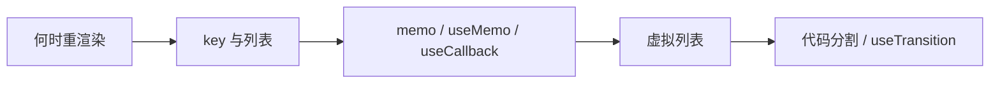

# 性能优化（Performance）

> 何时会重渲染、如何减少无效渲染、长列表与代码分割

---

## 核心问题

在学习 React 性能优化前，先理解这几个核心问题：

1. **什么时候会重渲染？** 自身 state 变、父组件渲染、Context 变、订阅的 store 变
2. **如何减少无效渲染？** React.memo、useMemo、useCallback 配合使用
3. **长列表卡顿怎么办？** 虚拟列表，只渲染可见区域
4. **首屏太慢怎么办？** 代码分割（React.lazy）、按路由拆 bundle

---

## 学习路线

---

## 文档导航

| 文档 | 内容 | 适合人群 |
|------|------|----------|
| [1-基础篇](./1-基础篇.md) | 何时重渲染、key 的作用、React.memo、useMemo、useCallback | 初学者，掌握基础优化手段 |
| [2-进阶篇](./2-进阶篇.md) | 虚拟列表、React.lazy、Suspense、useTransition | 中级开发者，掌握进阶优化 |

---

## 快速参考

### 优化三板斧

| 手段 | 作用 | 典型用法 |
|------|------|----------|
| **React.memo** | 阻止子组件无效重渲染 | 父经常渲染、子 props 多数不变时 |
| **useMemo** | 缓存计算结果 / 稳定对象引用 | 重计算、传给 memo 子组件的对象 |
| **useCallback** | 稳定函数引用 | 传给 memo 子组件的回调、useEffect 依赖 |

### 常见误区

- 只用 `memo` 但传内联对象/函数 → 引用每次变，memo 无效 → 需配合 `useMemo`/`useCallback`
- 简单计算也用 `useMemo` → Hook 本身有开销，可能更慢
- 过早优化 → 先保证功能正确，有性能问题再优化

---

## 常见问题速查

| 问题 | 答案 | 详见 |
|------|------|------|
| 父组件渲染子组件一定会渲染吗？ | 默认会；用 React.memo 且 props 未变可跳过 | 基础篇 |
| key 为什么不要用 index？ | 列表增删中间项时会导致错位、多余渲染 | 基础篇 |
| useMemo 和 useCallback 区别？ | useMemo 缓存返回值，useCallback 缓存函数本身；useCallback(fn,deps)≈useMemo(()=>fn,deps) | 基础篇、Hooks/2-进阶篇 |
| 长列表卡顿怎么解决？ | 虚拟列表（react-window 等），只渲染可见区域 | 进阶篇 |
| 首屏 bundle 太大怎么办？ | React.lazy + Suspense 按路由/组件懒加载 | 进阶篇 |

---

## 学习建议

1. **先理解何时重渲染**：state、父组件、Context、store 订阅
2. **掌握 memo + useMemo + useCallback**：三者配合才能稳定避免无效渲染
3. **key 用唯一 id**：列表有增删排序时不用 index
4. **有卡顿再优化**：先写对逻辑，再针对瓶颈优化
5. **长列表用虚拟列表**：成千上万条时必考虑

---

## 面试重点

- [ ] 能说清组件何时会重渲染
- [ ] 能解释 key 的作用及为什么列表慎用 index
- [ ] 能说明 memo、useMemo、useCallback 的区别与配合方式
- [ ] 知道虚拟列表、代码分割、useTransition 的适用场景

---

_开始学习：[1-基础篇](./1-基础篇.md)_
