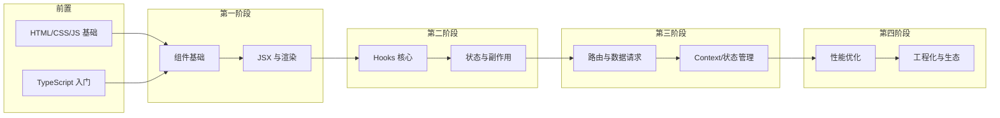
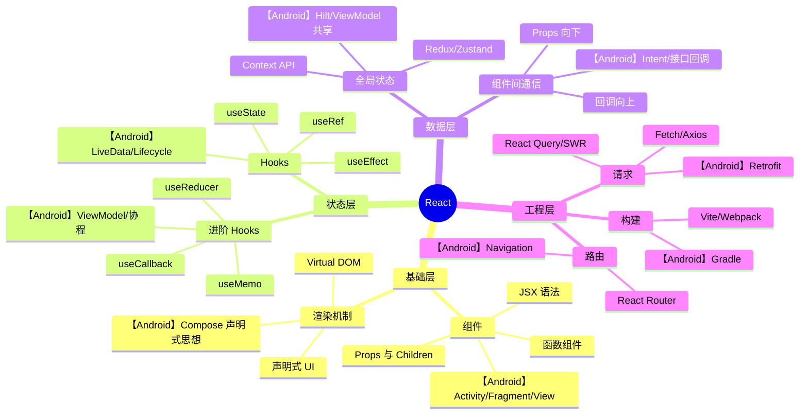
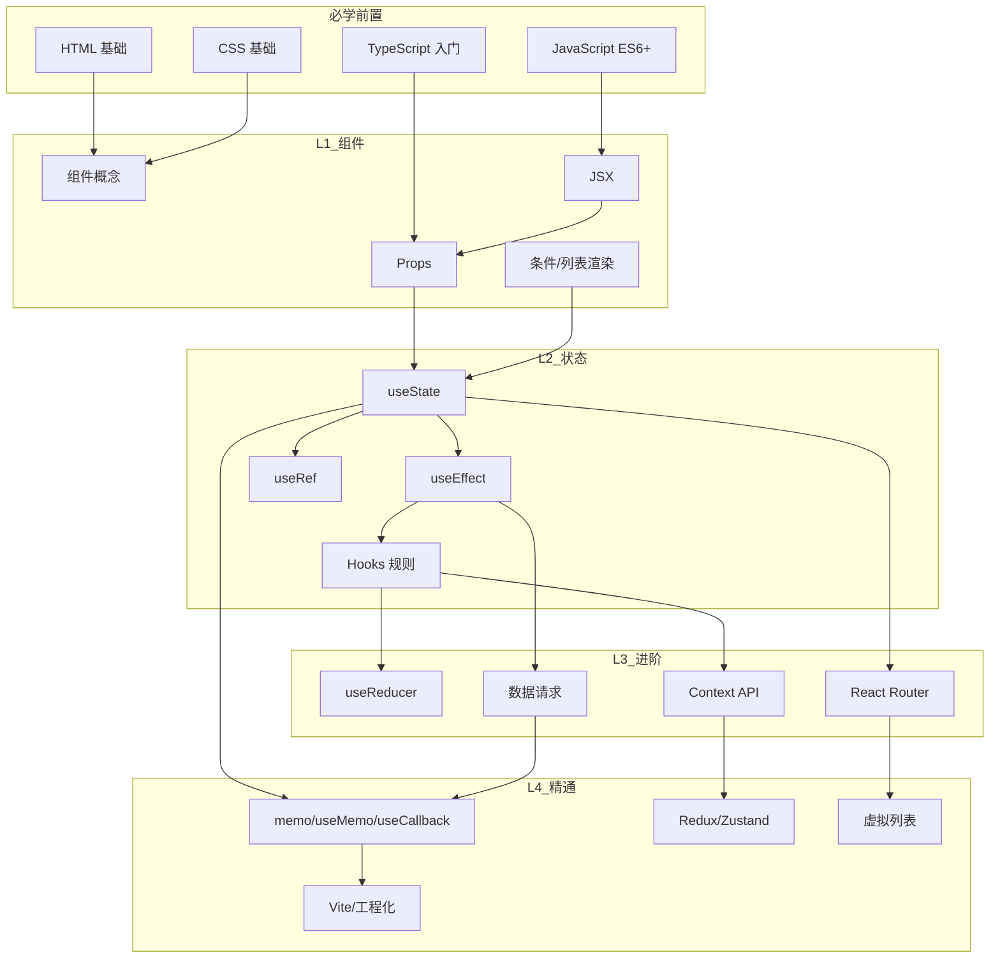
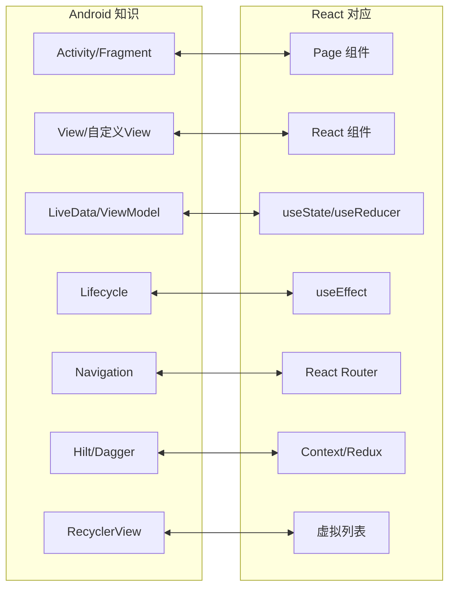
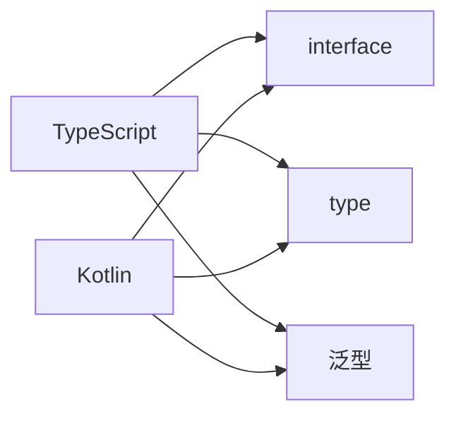
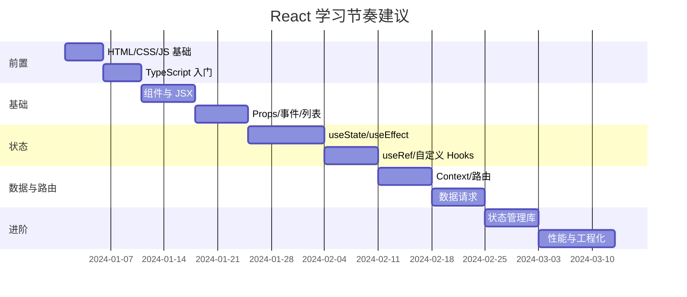

# React 学习路线（Android 开发者视角）

> 以 Android 开发经验为锚点，系统掌握现代 React 开发。每个阶段都标注了与 Android 的对照，方便迁移思维。

---

## 一、学习流程总览

---

## 二、知识图谱

### 2.1 核心知识结构（Mindmap）

### 2.2 知识点依赖关系图

### 2.3 Android ↔ React 学习对照图

---

## 三、分阶段学习流程

### 阶段 0：前置准备（约 1 周）

| 内容 | 目标 | Android 对照 |
|-----|------|-------------|
| **HTML/CSS** | 能写简单页面布局 | 类似 XML Layout + 样式 |
| **JavaScript ES6+** | 箭头函数、解构、Promise、async/await | 和 Kotlin 语法对照学 |
| **TypeScript 入门** | 类型、接口、泛型 | 和 Kotlin 类型系统很像 |

---

### 阶段 1：组件基础（约 2 周）

| 顺序 | 知识点 | 文档 | Android 对照 |
|-----|--------|------|-------------|
| 1 | 组件是什么、函数组件 | 组件基础/1-基础篇 | View、Compose 的 @Composable |
| 2 | JSX 语法、表达式、条件渲染 | 组件基础/1-基础篇 | 类似在代码里写 XML |
| 3 | Props、默认值、children | 组件基础/1-基础篇 | 类似构造参数、Intent 传参 |
| 4 | 列表渲染、key 的作用 | 组件基础/1-基础篇 | 类似 RecyclerView.Adapter + ViewHolder |
| 5 | 事件处理、表单受控组件 | 组件基础/1-基础篇 | setOnClickListener、EditText 双向绑定 |

**阶段目标**：能写纯展示 + 简单交互的组件树，理解「组件 = 函数 + Props」。

---

### 阶段 2：Hooks 与状态（约 2–3 周）

| 顺序 | 知识点 | 文档 | Android 对照 |
|-----|--------|------|-------------|
| 1 | useState：状态定义与更新 | Hooks/1-基础篇 | MutableLiveData |
| 2 | 不可变性、为什么不能改原对象 | Hooks/1-基础篇 | 与 Kotlin data class copy 对照 |
| 3 | useEffect：挂载、更新、卸载 | Hooks/1-基础篇 | Lifecycle Observer |
| 4 | 依赖数组、清理函数 | Hooks/1-基础篇 | 类似 viewModelScope 取消 |
| 5 | useRef：DOM 引用、持久化值 | Hooks/1-基础篇 | View.findViewById、非响应式变量 |
| 6 | useReducer：复杂状态逻辑 | Hooks/2-进阶篇 | 类似 MVI 的 reducer |
| 7 | 自定义 Hooks：逻辑复用 | Hooks/2-进阶篇 | 类似 ViewModel 抽业务逻辑 |

**阶段目标**：能正确用 useState/useEffect/useRef，理解「状态驱动 UI」和「副作用在 useEffect」。

---

### 阶段 3：数据与路由（约 2 周）

| 顺序 | 知识点 | 文档 | Android 对照 |
|-----|--------|------|-------------|
| 1 | 组件通信：Props 下传、回调上传 | 组件基础/2-进阶篇 | Intent、接口回调 |
| 2 | Context API：跨层级共享 | Context/1-基础篇 | Hilt 的 @Inject、单例 |
| 3 | React Router：路由、嵌套、参数 | Router/1-基础篇 | Navigation Component |
| 4 | 数据请求：Fetch/axios、loading/error | 数据请求/1-基础篇 | Retrofit + LiveData |
| 5 | React Query 或 SWR（可选） | 数据请求/2-进阶篇 | 类似 Repository + 缓存策略 |

**阶段目标**：能搭多页面 SPA、请求接口、用 Context 做简单全局状态。

---

### 阶段 4：状态管理与架构（约 1–2 周）

| 顺序 | 知识点 | 文档 | Android 对照 |
|-----|--------|------|-------------|
| 1 | 何时需要全局状态 | 状态管理/1-基础篇 | 多 Activity/Fragment 共享 ViewModel |
| 2 | Redux 思想：store、action、reducer | 状态管理/1-基础篇 | MVI 的 Model/Intent/Reducer |
| 3 | Zustand 或 Redux Toolkit 选型 | 状态管理/2-进阶篇 | 轻量 vs 规范，类似 SP vs DataStore |
| 4 | 服务端状态 vs 客户端状态 | 状态管理/2-进阶篇 | 网络数据 vs 本地 UI 状态 |

**阶段目标**：能区分本地状态和全局状态，会用一个现代状态库（Zustand 或 Redux Toolkit）。

---

### 阶段 5：性能与工程化（约 2 周）

| 顺序 | 知识点 | 文档 | Android 对照 |
|-----|--------|------|-------------|
| 1 | React.memo、避免无意义重渲染 | 性能优化/1-基础篇 | DiffUtil、ViewHolder 复用 |
| 2 | useMemo、useCallback 使用场景 | 性能优化/1-基础篇 | 避免重复创建对象/闭包 |
| 3 | 虚拟列表（react-window 等） | 性能优化/2-进阶篇 | RecyclerView |
| 4 | 代码分割、懒加载 React.lazy | 性能优化/2-进阶篇 | 动态加载、按需初始化 |
| 5 | Vite 项目结构、环境变量 | 工程化/1-基础篇 | Gradle 模块、buildTypes |
| 6 | 常见目录与规范 | 工程化/1-基础篇 | Android 包结构、架构分层 |

**阶段目标**：能分析渲染性能、会做列表与分包优化，熟悉一个现代构建工具（如 Vite）。

---

## 四、学习路径甘特图（建议节奏）

---

## 五、按主题的文档索引

| 主题 | 基础篇 | 进阶篇 | 源码篇 | Android 对照重点 |
|-----|--------|--------|--------|-----------------|
| 组件基础 | [Component/1-基础篇](./Component/1-基础篇.md) | [Component/2-进阶篇](./Component/2-进阶篇.md) | 待写 | Activity/View/Compose |
| Hooks | [Hooks/1-基础篇](./Hooks/1-基础篇.md) | [Hooks/2-进阶篇](./Hooks/2-进阶篇.md) | [Hooks/3-源码篇](./Hooks/3-源码篇.md) | LiveData/Lifecycle/ViewModel |
| Context | [Context/1-基础篇](./Context/1-基础篇.md) | [Context/2-进阶篇](./Context/2-进阶篇.md) | — | Hilt/依赖注入 |
| Router | [Router/1-基础篇](./Router/1-基础篇.md) | [Router/2-进阶篇](./Router/2-进阶篇.md) | — | Navigation |
| 状态管理 | [StateManagement/1-基础篇](./StateManagement/1-基础篇.md) | [StateManagement/2-进阶篇](./StateManagement/2-进阶篇.md) | — | MVVM/MVI |
| 性能优化 | [Performance/1-基础篇](./Performance/1-基础篇.md) | [Performance/2-进阶篇](./Performance/2-进阶篇.md) | — | RecyclerView/DiffUtil |
| 数据请求 | [DataFetching/1-基础篇](./DataFetching/1-基础篇.md) | [DataFetching/2-进阶篇](./DataFetching/2-进阶篇.md) | — | Retrofit/Repository |
| 工程化 | 待写 | — | — | Gradle/模块化 |

**状态管理与性能汇总**：[状态管理与性能-知识点汇总](./状态管理与性能-知识点汇总.md)（状态管理 + 性能优化速查与索引）

---

## 六、一句话速查（Android 开发者）

| 我想做… | 在 React 里用… | 在 Android 里类似… |
|--------|----------------|---------------------|
| 存一个会变的值，驱动 UI 更新 | `useState` | `MutableLiveData` |
| 组件挂载/更新时跑一段逻辑 | `useEffect` | `LifecycleObserver` |
| 拿 DOM 或保存不触发渲染的值 | `useRef` | `findViewById` / 普通变量 |
| 跨很多层传数据/方法 | `Context` | Hilt `@Inject` / 单例 |
| 页面跳转、带参数 | React Router | Navigation + 参数 |
| 发请求、管 loading/error | Fetch + useState 或 React Query | Retrofit + LiveData |
| 全局状态、多组件共享 | Context 或 Zustand/Redux | ViewModel 共享 / Hilt |
| 列表不卡、只渲染可见区域 | 虚拟列表（react-window） | RecyclerView |
| 减少子组件重渲染 | `React.memo` + `useMemo`/`useCallback` | DiffUtil、避免无效 notify |

---

## 七、学习建议（给 Android 同学）

1. **先建立对照**：每学一个 React 概念，立刻想「在 Android 里谁干这事」，记在笔记里。
2. **重点攻克思维差异**：声明式 UI、不可变数据、单向数据流，这三块和 Android 差异最大，多写小 Demo 体会。
3. **TypeScript 别跳过**：和 Kotlin 一样，类型能帮你少踩坑，从第一天就用 TS 写 React。
4. **按阶段来**：不要一上来就 Redux、源码，先把「组件 + Hooks + 路由 + 请求」这条主线走通，再上状态管理和性能。
5. **用项目串起来**：选一个小项目（如 Todo、简单列表页）从 0 搭到「路由 + 请求 + 简单全局状态」，比只看文档有效。

---

_本文档会随 React 知识库的完善而更新，优先补齐「组件基础」和「Hooks」两条主线。_
