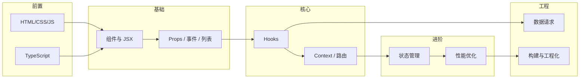
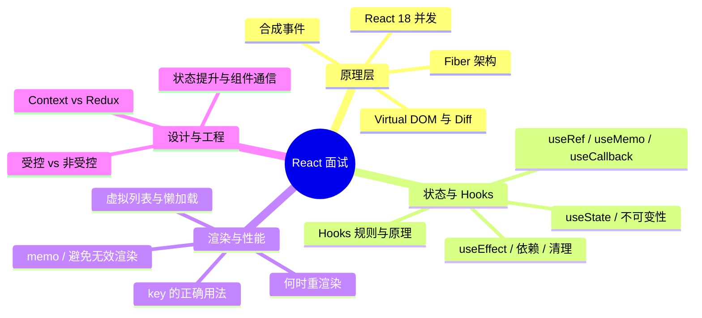

# React 知识点整理大纲与学习路线

> 兼顾「学习顺序」和「写作整理」：上半部分是按阶段的学习路线，下半部分是按主题的文档大纲与写作要点。

---

## 一、学习路线总览



| 阶段 | 核心目标 | 建议时长 |
|------|----------|----------|
| **前置** | HTML/CSS/JS 基础 + TypeScript 入门 | 约 1 周 |
| **基础** | 组件、JSX、Props、事件、条件/列表渲染 | 约 2 周 |
| **核心** | useState/useEffect/useRef、Context、React Router | 约 2–3 周 |
| **进阶** | 状态管理（Zustand/Redux）、性能优化 | 约 1–2 周 |
| **工程** | 数据请求、Vite/工程化、目录规范 | 约 1–2 周 |

---

## 二、按阶段的学习路线（细）

### 阶段 0：前置

| 顺序 | 内容 | 整理时可写成 |
|------|------|--------------|
| 1 | HTML/CSS/JS 基础 | 不单独建 React 文档，可放「前置说明」 |
| 2 | TypeScript：类型、接口、泛型 | 同上或单独 `前置/TypeScript入门.md` |

### 阶段 1：组件基础

| 顺序 | 知识点 | 对应文档 |
|------|--------|----------|
| 1 | 组件是什么、函数组件 | 组件基础 / 1-基础篇 |
| 2 | JSX 语法、表达式、条件渲染 | 组件基础 / 1-基础篇 |
| 3 | Props、默认值、children | 组件基础 / 1-基础篇 |
| 4 | 列表渲染、key 的意义 | 组件基础 / 1-基础篇 |
| 5 | 事件处理、受控/非受控表单 | 组件基础 / 1-基础篇 |
| 6 | 组合 vs 继承、组件通信（Props 下传、回调上传） | 组件基础 / 2-进阶篇 |

### 阶段 2：Hooks 与状态

| 顺序 | 知识点 | 对应文档 |
|------|--------|----------|
| 1 | useState：定义、更新、不可变性 | Hooks / 1-基础篇 |
| 2 | useEffect：挂载/更新/卸载、依赖数组、清理函数 | Hooks / 1-基础篇 |
| 3 | useRef：DOM 引用、持久化值 | Hooks / 1-基础篇 |
| 4 | useReducer：复杂状态逻辑 | Hooks / 2-进阶篇 |
| 5 | 自定义 Hooks：逻辑复用 | Hooks / 2-进阶篇 |
| 6 | Hooks 规则与原理（可选放源码篇） | Hooks / 3-源码篇 |

### 阶段 3：数据与路由

| 顺序 | 知识点 | 对应文档 |
|------|--------|----------|
| 1 | Context API：跨层级共享 | Context / 1-基础篇 |
| 2 | React Router：路由、嵌套、参数、Navigate | Router / 1-基础篇 |
| 3 | 数据请求：Fetch/axios、loading/error 状态 | 数据请求 / 1-基础篇 |
| 4 | React Query / SWR（可选） | 数据请求 / 2-进阶篇 |

### 阶段 4：状态管理与性能

| 顺序 | 知识点 | 对应文档 |
|------|--------|----------|
| 1 | 何时要全局状态、服务端状态 vs 客户端状态 | 状态管理 / 1-基础篇 |
| 2 | Redux 思想、Zustand / Redux Toolkit 选型 | 状态管理 / 1–2 篇 |
| 3 | React.memo、useMemo、useCallback | 性能优化 / 1-基础篇 |
| 4 | 虚拟列表、代码分割与 React.lazy | 性能优化 / 2-进阶篇 |

### 阶段 5：工程与生态

| 顺序 | 知识点 | 对应文档 |
|------|--------|----------|
| 1 | Vite 项目结构、环境变量、目录规范 | 工程化 / 1-基础篇 |
| 2 | 样式方案：CSS Modules、Tailwind 等（可选单独主题） | 样式方案 / 1-基础篇 |

---

## 三、按主题的文档大纲（供整理用）

每个主题采用与 Android 一致的**三级（或四级）文档体系**：

```
react/[主题名]/
├── README.md       # 本主题导航 + 核心问题预览
├── 1-基础篇.md     # 是什么、怎么用、基本原理
├── 2-进阶篇.md     # 高级用法、性能、最佳实践、选型
├── 3-源码篇.md     # 可选，设计哲学、核心流程、关键实现
└── 4-实战篇.md     # 可选，完整小项目或常见踩坑
```

### 3.1 主题清单与文件夹规划

| 序号 | 主题 | 文件夹 | 基础篇 | 进阶篇 | 源码篇 | 实战篇 |
|------|------|--------|--------|--------|--------|--------|
| 1 | 组件基础 | `Component/` | ✅ | ✅ | ✅ | 可选 |
| 2 | Hooks | `Hooks/` | ✅ 已完成 | ✅ 已完成 | ✅ 已完成 | 可选 |
| 3 | Context API | `Context/` | ✅ | ✅ | — | — |
| 4 | 路由 | `Router/` | ✅ | ✅ | — | 可选 |
| 5 | 状态管理 | `StateManagement/` | ✅ | ✅ | — | 可选 |
| 6 | 性能优化 | `Performance/` | ✅ | ✅ | 可选 | 可选 |
| 7 | 数据请求 | `DataFetching/` | ✅ | ✅ | — | 可选 |
| 8 | 样式方案 | `Styling/` | ✅ | 可选 | — | — |
| 9 | 工程化 | `Engineering/` | ✅ | 可选 | — | — |

### 3.2 各主题写作要点（与 common.mdc / react.mdc 对齐）

- **基础篇**：定义、通俗理解、基本用法（TS + Hooks）、常见误区。
- **进阶篇**：高级特性、性能相关、与同类方案对比、适用边界。
- **源码篇**：设计哲学、核心流程图（Mermaid）、关键实现、延伸思考。
- **实战篇**：小项目串联或「常见坑 + 解决方案」。

---

## 四、推荐整理顺序

按「依赖少、用得多」的原则，建议你按下面顺序开坑，方便后面主题引用前面已写内容：

1. **组件基础**（Component）— 一切的基础，先写。
2. **Hooks**（Hooks）— 状态与副作用，使用最频繁。
3. **Context**（Context）— 篇幅相对小，写完即可做「跨层级通信」主线收尾。
4. **路由**（Router）— 做多页面 SPA 必备。
5. **数据请求**（DataFetching）— 和 Hooks、Context 结合紧密。
6. **状态管理**（StateManagement）— 在 Context 之后写，对比更清晰。
7. **性能优化**（Performance）— 有了一定代码量再写更好理解。
8. **工程化**（Engineering）、**样式方案**（Styling）— 可最后或按需补。

---

## 五、面试向重点学习点

> 按日常前端面试高频考点整理，每个点都要能「说清是什么、为什么、怎么用、有什么坑」。整理文档时可在对应主题下加「面试检验」小节。

### 5.1 面试考察领域总览



### 5.2 原理类（必背能讲）

| 学习点 | 要能回答的问题 | 建议落在文档 |
|--------|----------------|--------------|
| **Virtual DOM** | 是什么、为什么用、和真实 DOM 的差异、不是银弹 | Component 或 Hooks 的 3-源码篇 |
| **Diff 算法** | 同层比较、O(n) 假设、type/key 的作用、为什么列表要用 key | Component / 3-源码篇、Performance / 1-基础篇 |
| **Fiber** | 为什么引入、Render 阶段可中断 / Commit 不可中断、时间切片 | Hooks / 3-源码篇 或单独「React 原理」 |
| **合成事件** | 事件委托到 root、为什么 e.stopPropagation 有时「无效」、与原生事件顺序 | Component / 2-进阶篇 或 EventDispatch |
| **React 18** | 自动批处理、useTransition、Suspense、并发渲染能解决什么问题 | Hooks / 2-进阶篇、可单独小节 |

### 5.3 Hooks 类（最高频）

| 学习点 | 要能回答的问题 | 建议落在文档 |
|--------|----------------|--------------|
| **useState** | 用法、为什么不能直接改 state、批处理（多次 setState 只渲染一次）、函数式更新 | Hooks / 1-基础篇 |
| **useEffect** | 执行时机、依赖数组空/不传/有依赖的区别、清理函数何时执行、竞态与取消请求 | Hooks / 1-基础篇 |
| **useRef** | 和 state 的区别、拿 DOM、存「不触发渲染」的值、forwardRef + useImperativeHandle | Hooks / 1-基础篇、2-进阶篇 |
| **useMemo / useCallback** | 解决什么问题、依赖怎么写、什么时候其实不需要、误用反而更慢 | Performance / 1-基础篇、Hooks / 2-进阶篇 |
| **Hooks 规则** | 为什么只能在顶层调用、不能在条件/循环里、React 怎么做到的（调用顺序） | Hooks / 1-基础篇、3-源码篇 |
| **闭包陷阱** | useEffect 里拿到旧值、setTimeout 里 state 是旧的、怎么解决 | Hooks / 1-基础篇、2-进阶篇 |

### 5.4 渲染与性能（几乎必问）

| 学习点 | 要能回答的问题 | 建议落在文档 |
|--------|----------------|--------------|
| **何时会重渲染** | 父渲染子就渲染、state/context 变了会渲染、怎么验证（React DevTools） | Performance / 1-基础篇 |
| **key 的作用** | 为什么列表要有 key、为什么不要用 index（增删中间项）、key 变了会怎样 | Component / 1-基础篇、Performance / 1-基础篇 |
| **React.memo** | 做什么、浅比较、什么时候用了也白用（props 引用总变） | Performance / 1-基础篇 |
| **useMemo / useCallback 配合 memo** | 子组件 memo 了但父传了内联函数/对象怎么办 | Performance / 1-基础篇 |
| **虚拟列表** | 长列表卡顿原因、只渲染可见区域、react-window 等 | Performance / 2-进阶篇 |
| **代码分割** | React.lazy、Suspense、按路由拆分 bundle | Performance / 2-进阶篇、Engineering |

### 5.5 状态与设计（常问选型）

| 学习点 | 要能回答的问题 | 建议落在文档 |
|--------|----------------|--------------|
| **受控 vs 非受控** | 区别、各自适用场景、表单用哪种多 | Component / 1-基础篇 |
| **状态提升** | 多个组件要共享状态时往哪放、单向数据流 | Component / 2-进阶篇 |
| **Context** | 适用场景、会触发所有消费组件重渲染、和 Redux 的区别 | Context / 1-基础篇、StateManagement / 1-基础篇 |
| **何时上 Redux/Zustand** | 跨页面/多组件共享、需要可预测、Context 不够时 | StateManagement / 1-基础篇 |
| **服务端状态 vs 客户端状态** | 接口数据放哪、UI 临时状态放哪、React Query 管哪一类 | DataFetching / 1-2 篇、StateManagement / 2-进阶篇 |

### 5.6 面试前自测清单（能打勾再上考场）

| 类别 | 自测项 | 对应上表 |
|------|--------|----------|
| 原理 | 能画/讲 Virtual DOM → Diff → 更新 DOM 的流程 | 5.2 |
| 原理 | 能说 Fiber 的两阶段、为什么可中断 | 5.2 |
| 原理 | 能说 React 18 自动批处理、和 17 的差异 | 5.2 |
| Hooks | useState 批处理、函数式更新、不可变 | 5.3 |
| Hooks | useEffect 依赖空/不传/有依赖、清理函数 | 5.3 |
| Hooks | useRef 和 useState 区别、典型用法 | 5.3 |
| Hooks | useMemo/useCallback 解决什么问题、何时可不用 | 5.3 |
| Hooks | 为什么 Hooks 不能写在条件里 | 5.3 |
| 性能 | 什么情况会重渲染、key 为什么别用 index | 5.4 |
| 性能 | memo + useCallback/useMemo 怎么配合 | 5.4 |
| 设计 | 受控/非受控、Context 和 Redux 选型 | 5.5 |

整理各主题文档时，在**基础篇/进阶篇末尾**可加 3～5 道「面试检验」题，答案按「结论 → 原理 → 可举业务例子」组织，和 react.mdc 里要求一致。

---

## 六、与现有 README 的关系

- **react/README.md**：保留为「总入口」+ 学习流程图 + Android 对照 + 一句话速查；其中的「按主题的文档索引」可改为对上述各主题文件夹的链接，并随你写完的文档逐步把「待写」改成链接。
- **本文件（React知识点整理大纲.md）**：专门用于「学习路线 + 整理大纲 + 面试重点」，写新文档时按这里的阶段与主题清单拆任务，并按第五节标注重难点。

---

_可根据你实际进度增删主题或调整阶段顺序，保持与 react.mdc、common.mdc 一致即可。_
