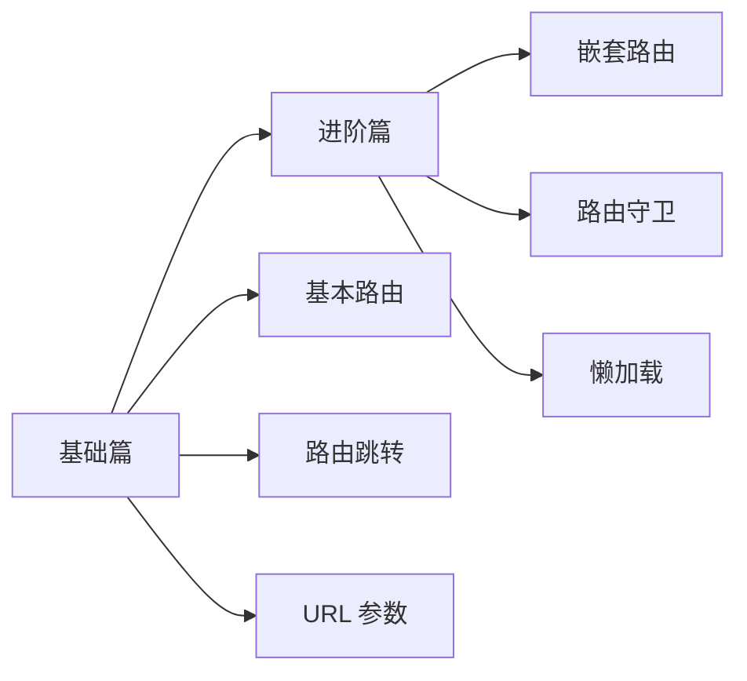

# React Router

## 快速了解

**React Router 是什么？**

React Router 是 React 官方推荐的路由库，用于实现单页应用（SPA）的页面跳转和导航。它让你可以在不刷新页面的情况下切换不同的视图。

**什么时候用 React Router？**

- 需要实现多页面应用（如首页、关于页、用户页）
- 需要根据 URL 显示不同的内容
- 需要传递 URL 参数（如 `/user/123`）
- 需要实现嵌套路由（如 `/dashboard/settings`）

**典型使用场景**

```
多页面应用（首页、关于、用户中心）
带参数的页面（用户详情、文章详情）
嵌套路由（管理后台的多级菜单）
受保护的路由（需要登录才能访问）
```

## 学习路线



## 文档导航

### [1-基础篇](./1-基础篇.md)
- React Router 是什么
- 如何配置路由
- 路由跳转的方式
- URL 参数传递
- 完整示例

### [2-进阶篇](./2-进阶篇.md)
- 嵌套路由
- 路由守卫（权限控制）
- 路由懒加载
- 404 页面
- 最佳实践

## 核心概念

| 概念 | 说明 | 示例 |
|-----|------|------|
| **BrowserRouter** | 路由容器，使用 HTML5 History API | 包裹整个应用 |
| **Routes** | 路由配置容器 | 包含多个 Route |
| **Route** | 单个路由规则 | `<Route path="/home" element={<Home />} />` |
| **Link** | 声明式导航 | `<Link to="/about">关于</Link>` |
| **useNavigate** | 编程式导航 | `navigate('/home')` |
| **useParams** | 获取 URL 参数 | `const { id } = useParams()` |

## 快速开始

### 安装

```bash
npm install react-router-dom
```

### 基本使用

```typescript
import { BrowserRouter, Routes, Route, Link } from 'react-router-dom'

function App() {
  return (
    <BrowserRouter>
      {/* 导航栏 */}
      <nav>
        <Link to="/">首页</Link>
        <Link to="/about">关于</Link>
      </nav>

      {/* 路由配置 */}
      <Routes>
        <Route path="/" element={<Home />} />
        <Route path="/about" element={<About />} />
      </Routes>
    </BrowserRouter>
  )
}

function Home() {
  return <h1>首页</h1>
}

function About() {
  return <h1>关于页面</h1>
}
```

## 常见路由模式

### 1. 基本路由

```typescript
<Routes>
  <Route path="/" element={<Home />} />
  <Route path="/about" element={<About />} />
  <Route path="/contact" element={<Contact />} />
</Routes>
```

### 2. 动态路由（带参数）

```typescript
<Routes>
  <Route path="/user/:id" element={<UserDetail />} />
  <Route path="/post/:id" element={<PostDetail />} />
</Routes>

function UserDetail() {
  const { id } = useParams()
  return <div>用户 ID: {id}</div>
}
```

### 3. 嵌套路由

```typescript
<Routes>
  <Route path="/dashboard" element={<Dashboard />}>
    <Route path="profile" element={<Profile />} />
    <Route path="settings" element={<Settings />} />
  </Route>
</Routes>

function Dashboard() {
  return (
    <div>
      <h1>Dashboard</h1>
      <Outlet />  {/* 子路由渲染位置 */}
    </div>
  )
}
```

### 4. 404 页面

```typescript
<Routes>
  <Route path="/" element={<Home />} />
  <Route path="/about" element={<About />} />
  <Route path="*" element={<NotFound />} />  {/* 匹配所有未定义的路由 */}
</Routes>
```

## 路由跳转方式

### 1. 声明式导航（Link）

```typescript
import { Link } from 'react-router-dom'

function Nav() {
  return (
    <nav>
      <Link to="/">首页</Link>
      <Link to="/about">关于</Link>
      <Link to="/user/123">用户详情</Link>
    </nav>
  )
}
```

### 2. 编程式导航（useNavigate）

```typescript
import { useNavigate } from 'react-router-dom'

function LoginButton() {
  const navigate = useNavigate()

  const handleLogin = async () => {
    // 登录逻辑
    await login()
    // 跳转到首页
    navigate('/')
  }

  return <button onClick={handleLogin}>登录</button>
}
```

## 与其他路由库对比

| 特性 | React Router | Next.js 路由 | Vue Router |
|-----|-------------|-------------|-----------|
| **路由方式** | 配置式 | 文件系统 | 配置式 |
| **学习成本** | 中 | 低 | 中 |
| **灵活性** | 高 | 中 | 高 |
| **SSR 支持** | 需要额外配置 | 内置 | 需要 Nuxt.js |

## 版本说明

本文档基于 **React Router v6**，与 v5 有较大差异：

| 特性 | v5 | v6 |
|-----|----|----|
| **Switch** | `<Switch>` | `<Routes>` |
| **component** | `component={Home}` | `element={<Home />}` |
| **嵌套路由** | 需要在子组件配置 | 直接嵌套 Route |
| **useHistory** | `useHistory()` | `useNavigate()` |

---

_建议先学习基础篇，掌握路由的基本使用，再学习进阶篇了解嵌套路由和路由守卫。_
