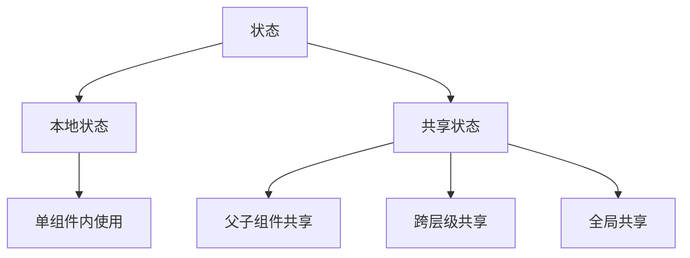
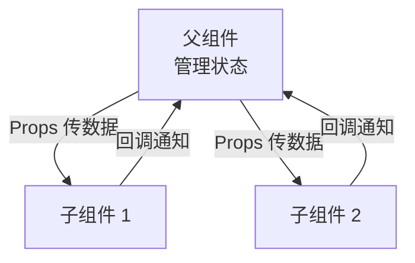
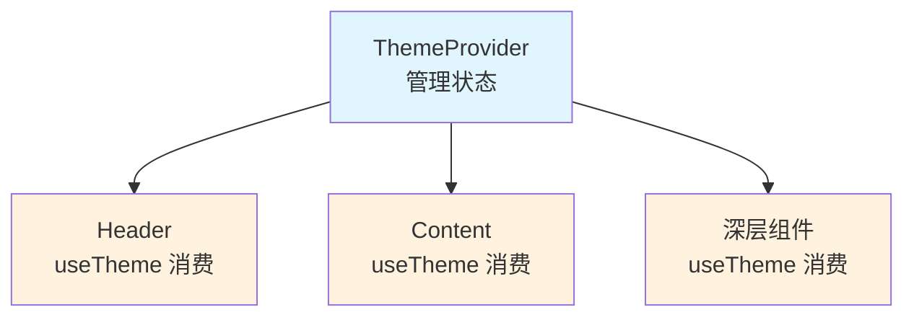

# 状态管理 · 基础篇

> 本地状态、状态提升、Context API，以及何时需要全局状态

---

## 一、什么是状态？

### 定义

**状态（State）** 是组件里会随时间变化的数据。当状态变化时，React 会自动重新渲染组件，更新 UI。

### 通俗理解

可以把状态想成「组件的记忆」：
- 输入框记住用户输入的内容
- 开关记住是开还是关
- 列表记住当前显示的数据

没有状态，组件就是「无记忆」的，每次渲染都一样。有了状态，组件才能「响应用户操作」。

### 状态的分类



| 类型 | 说明 | 典型方案 |
|------|------|----------|
| **本地状态** | 只在单个组件内使用 | `useState`、`useReducer` |
| **共享状态（父子）** | 父子组件之间共享 | Props 传递 + 状态提升 |
| **共享状态（跨层级）** | 跨多层组件共享 | Context API |
| **全局状态** | 跨页面、多模块共享 | Zustand、Redux |

---

## 二、本地状态：useState

### 什么时候用

数据只在**当前组件**内使用，且数据变化时需要更新 UI。

### 如何使用

```typescript
import { useState } from 'react'

function Counter() {
  // count 是状态，setCount 用来更新状态
  const [count, setCount] = useState(0)

  return (
    <div>
      <p>当前计数：{count}</p>
      <button onClick={() => setCount(count + 1)}>+1</button>
      <button onClick={() => setCount(0)}>重置</button>
    </div>
  )
}
```

### 常见问题

#### 1. 不要直接修改状态

```typescript
// ❌ 错误：直接修改，React 检测不到变化，不会重新渲染
const [user, setUser] = useState({ name: '张三', age: 25 })
user.age = 26  // 不会触发重新渲染

// ✅ 正确：创建新对象
setUser({ ...user, age: 26 })  // 会触发重新渲染
```

**为什么？** React 通过**引用比较**判断状态是否变化。直接修改对象，引用不变，React 认为没变化。

#### 2. 状态更新是异步的

```typescript
function Counter() {
  const [count, setCount] = useState(0)

  const handleClick = () => {
    setCount(count + 1)
    console.log(count)  // ❌ 还是旧值 0，不是 1
  }

  return <button onClick={handleClick}>点击</button>
}
```

**解决方法**：如果需要基于旧值更新，用**函数式更新**：

```typescript
const handleClick = () => {
  setCount(prev => prev + 1)  // ✅ prev 是最新值
}
```

#### 3. 多次 setState 会批处理

```typescript
const handleClick = () => {
  setCount(count + 1)  // 假设 count 是 0
  setCount(count + 1)  // 还是基于 0，最终只加 1
}

// ✅ 正确：用函数式更新
const handleClick = () => {
  setCount(prev => prev + 1)  // 0 + 1 = 1
  setCount(prev => prev + 1)  // 1 + 1 = 2
}
```

---

## 三、状态提升：父子组件共享状态

### 什么时候用

**多个子组件需要共享同一状态**时，把状态放到它们的**共同父组件**里，通过 Props 传下去。

### 通俗理解

就像兄弟姐妹要共享一个玩具，玩具不能同时在两个人手里，所以放在父母那里，谁要用就问父母拿。

### 如何使用

```typescript
interface Todo {
  id: string
  text: string
  done: boolean
}

// 父组件：管理状态
function TodoApp() {
  const [todos, setTodos] = useState<Todo[]>([])

  const addTodo = (text: string) => {
    const newTodo = { id: Date.now().toString(), text, done: false }
    setTodos([...todos, newTodo])
  }

  const toggleTodo = (id: string) => {
    setTodos(todos.map(todo =>
      todo.id === id ? { ...todo, done: !todo.done } : todo
    ))
  }

  return (
    <div>
      <TodoInput onAdd={addTodo} />
      <TodoList todos={todos} onToggle={toggleTodo} />
    </div>
  )
}

// 子组件 1：输入框，通过回调通知父组件
function TodoInput({ onAdd }: { onAdd: (text: string) => void }) {
  const [text, setText] = useState('')

  const handleSubmit = (e: React.FormEvent) => {
    e.preventDefault()
    if (text.trim()) {
      onAdd(text)
      setText('')
    }
  }

  return (
    <form onSubmit={handleSubmit}>
      <input value={text} onChange={(e) => setText(e.target.value)} />
      <button type="submit">添加</button>
    </form>
  )
}

// 子组件 2：列表，接收数据和回调
function TodoList({ todos, onToggle }: { todos: Todo[]; onToggle: (id: string) => void }) {
  return (
    <ul>
      {todos.map(todo => (
        <li key={todo.id} onClick={() => onToggle(todo.id)}>
          <input type="checkbox" checked={todo.done} readOnly />
          <span style={{ textDecoration: todo.done ? 'line-through' : 'none' }}>
            {todo.text}
          </span>
        </li>
      ))}
    </ul>
  )
}
```

### 单向数据流



**核心原则**：
- **数据向下流**：父组件通过 Props 把数据传给子组件
- **事件向上传**：子组件通过回调通知父组件更新状态

---

## 四、Context API：跨层级共享状态

### 什么时候用

多个组件需要共享数据，但它们**层级很深**，用 Props 层层传递太繁琐（Props Drilling）。

### 典型场景

- **主题**（亮色/暗色）
- **语言**（中文/英文）
- **用户信息**（登录状态、用户名）

### 如何使用

#### 1. 创建 Context

```typescript
import { createContext, useContext, useState, ReactNode } from 'react'

// 定义 Context 的类型
interface ThemeContextType {
  theme: 'light' | 'dark'
  toggleTheme: () => void
}

// 创建 Context，提供默认值
const ThemeContext = createContext<ThemeContextType | undefined>(undefined)
```

#### 2. 提供 Provider

```typescript
// Provider 组件：管理状态，提供给子组件
function ThemeProvider({ children }: { children: ReactNode }) {
  const [theme, setTheme] = useState<'light' | 'dark'>('light')

  const toggleTheme = () => {
    setTheme(prev => prev === 'light' ? 'dark' : 'light')
  }

  return (
    <ThemeContext.Provider value={{ theme, toggleTheme }}>
      {children}
    </ThemeContext.Provider>
  )
}
```

#### 3. 消费 Context

```typescript
// 自定义 Hook：方便消费 Context
function useTheme() {
  const context = useContext(ThemeContext)
  if (!context) {
    throw new Error('useTheme 必须在 ThemeProvider 内使用')
  }
  return context
}

// 使用 Context 的组件
function Header() {
  const { theme, toggleTheme } = useTheme()

  return (
    <header style={{ background: theme === 'light' ? '#fff' : '#333' }}>
      <h1>我的网站</h1>
      <button onClick={toggleTheme}>
        切换到 {theme === 'light' ? '暗色' : '亮色'}
      </button>
    </header>
  )
}

function Content() {
  const { theme } = useTheme()
  return (
    <div style={{ color: theme === 'light' ? '#000' : '#fff' }}>
      <p>这是内容区域</p>
    </div>
  )
}

// 根组件
function App() {
  return (
    <ThemeProvider>
      <Header />
      <Content />
    </ThemeProvider>
  )
}
```

### Context 的结构



### 常见问题

#### 1. Context 会导致性能问题吗？

**会**。Context 的值变化时，**所有消费这个 Context 的组件都会重新渲染**，即使它们只用了其中一部分数据。

**优化方法**：

```typescript
// ❌ 不好：theme 和 user 放一起，theme 变了 user 相关组件也重渲染
const AppContext = createContext({ theme: 'light', user: null })

// ✅ 好：拆分成多个 Context
const ThemeContext = createContext('light')
const UserContext = createContext(null)
```

#### 2. 什么时候不要用 Context？

- **频繁变化的状态**：如输入框内容、滚动位置（会导致大量重渲染）
- **只在少数组件间共享**：直接用 Props 传递更清晰
- **复杂的状态逻辑**：考虑用 Zustand 或 Redux

---

## 五、何时需要全局状态管理？

### 判断标准

| 场景 | 是否需要全局状态 | 推荐方案 |
|------|-----------------|----------|
| 单组件内状态 | ❌ | `useState` |
| 父子组件共享 | ❌ | Props + 状态提升 |
| 跨 2-3 层组件共享 | ❌ | Props 或 Context |
| 跨多层组件共享（主题、语言） | ⚠️ | Context（简单场景） |
| 跨页面共享（用户信息、购物车） | ✅ | Zustand/Redux |
| 复杂状态逻辑（需要中间件、调试） | ✅ | Redux |
| 服务端状态（接口数据） | ✅ | React Query/SWR |

### 什么时候用 Context 够用？

- 数据**不频繁变化**（如主题、语言、用户信息）
- 消费的组件**不多**
- 不需要**时间旅行调试**、中间件

### 什么时候需要 Zustand/Redux？

- 数据需要**跨页面共享**（如购物车、用户登录状态）
- 状态逻辑**复杂**（多个 action、需要中间件）
- 需要**可预测的状态更新**、调试工具
- 团队**已有 Redux 经验**，项目大

---

## 六、状态派生：不要重复存储

### 什么是状态派生？

从已有状态**计算**出新值，而不是把新值也存成状态。

### 错误示例

```typescript
// ❌ 不好：completedCount 可以从 todos 计算出来，不需要单独存
function TodoApp() {
  const [todos, setTodos] = useState<Todo[]>([])
  const [completedCount, setCompletedCount] = useState(0)

  const addTodo = (text: string) => {
    const newTodo = { id: Date.now().toString(), text, done: false }
    setTodos([...todos, newTodo])
    // 每次都要手动更新 completedCount，容易出错
  }

  const toggleTodo = (id: string) => {
    setTodos(todos.map(todo => {
      if (todo.id === id) {
        const newDone = !todo.done
        setCompletedCount(completedCount + (newDone ? 1 : -1))
        return { ...todo, done: newDone }
      }
      return todo
    }))
  }

  return <div>已完成：{completedCount}</div>
}
```

### 正确示例

```typescript
// ✅ 好：completedCount 从 todos 派生，不需要单独存
function TodoApp() {
  const [todos, setTodos] = useState<Todo[]>([])

  // 直接计算，不需要额外状态
  const completedCount = todos.filter(todo => todo.done).length

  const addTodo = (text: string) => {
    const newTodo = { id: Date.now().toString(), text, done: false }
    setTodos([...todos, newTodo])
    // completedCount 会自动更新
  }

  const toggleTodo = (id: string) => {
    setTodos(todos.map(todo =>
      todo.id === id ? { ...todo, done: !todo.done } : todo
    ))
    // completedCount 会自动更新
  }

  return <div>已完成：{completedCount}</div>
}
```

**为什么？**
- **减少状态数量**：状态越少，越容易维护
- **避免不一致**：派生值总是和源状态同步，不会出错
- **性能通常够用**：简单计算（如 filter、map）很快，不需要优化

**什么时候需要优化？**  
如果计算很慢（如大数组排序、复杂运算），用 `useMemo` 缓存：

```typescript
const completedCount = useMemo(
  () => todos.filter(todo => todo.done).length,
  [todos]
)
```

---

## 七、常见问题

| 问题 | 原因 | 解决 |
|------|------|------|
| 直接修改状态不生效 | React 用引用比较判断变化 | 创建新对象/数组：`setState({ ...old, key: newValue })` |
| 多次 setState 只生效一次 | 批处理，基于同一快照 | 用函数式更新：`setState(prev => ...)` |
| Context 变化导致大量重渲染 | 所有消费者都会重渲染 | 拆分 Context、用 useMemo 优化 |
| 状态和派生值不一致 | 手动维护派生状态容易出错 | 直接计算派生值，不要存成状态 |
| 不知道用 Context 还是 Redux | 场景不清晰 | 简单跨层级用 Context，跨页面/复杂逻辑用 Redux |

---

## 八、实用检验（自测）

1. **什么时候状态要提升到父组件？**  
   多个子组件需要共享同一状态时，把状态放到共同父组件，通过 Props 传下去。

2. **Context 的性能问题是什么？如何优化？**  
   Context 变化时所有消费者都重渲染。优化：拆分 Context、用 useMemo 缓存值、避免频繁变化的状态用 Context。

3. **什么是状态派生？为什么不要重复存储？**  
   从已有状态计算出新值。重复存储会增加维护成本、容易不一致，直接计算更简单。

4. **什么时候用 Context，什么时候用 Zustand/Redux？**  
   Context：跨层级共享、不频繁变化（主题、语言）。Zustand/Redux：跨页面共享、复杂逻辑、需要调试工具。

5. **为什么不能直接修改状态？**  
   React 通过引用比较判断状态是否变化。直接修改对象/数组，引用不变，React 认为没变化，不会重新渲染。

---

_下一篇：[2-进阶篇](./2-进阶篇.md)（Zustand/Redux 选型、服务端状态 vs 客户端状态、最佳实践）_
