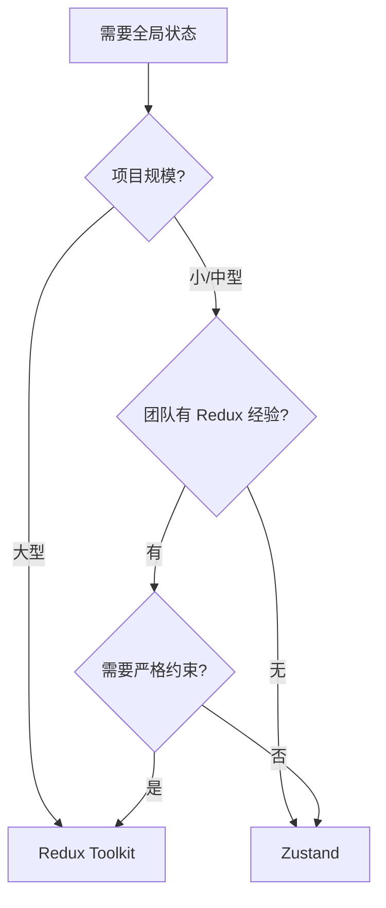
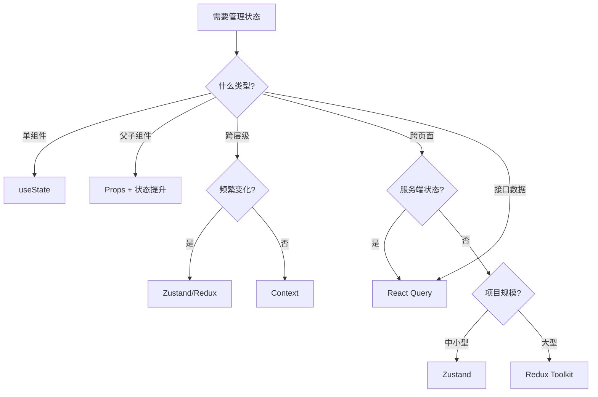

# 状态管理 · 进阶篇

> Zustand/Redux 选型、服务端状态 vs 客户端状态、最佳实践

---

## 一、全局状态管理方案对比

### 主流方案

| 方案 | 核心理念 | 适用场景 | 学习曲线 |
|------|----------|----------|----------|
| **Zustand** | 轻量、简单、基于 Hooks | 中小型项目、快速开发 | ⭐ |
| **Redux Toolkit** | 可预测、单一数据源、严格约束 | 大型项目、需要强约束和调试 | ⭐⭐⭐ |
| **Jotai** | 原子化状态、类似 Recoil | 需要细粒度更新、复杂依赖 | ⭐⭐ |
| **MobX** | 响应式、自动追踪依赖 | 习惯面向对象、需要自动更新 | ⭐⭐ |

**本文重点**：Zustand 和 Redux Toolkit（最常用）

---

## 二、Zustand：轻量级全局状态

### 什么时候用 Zustand？

- 项目**中小型**，不需要复杂的中间件和调试工具
- 团队**没有 Redux 经验**，希望快速上手
- 需要**跨页面共享状态**（如用户信息、购物车）
- 不想写太多样板代码

### 如何使用

#### 1. 安装

```bash
npm install zustand
```

#### 2. 创建 Store

```typescript
import { create } from 'zustand'

interface User {
  id: string
  name: string
  email: string
}

interface UserStore {
  user: User | null
  isLoading: boolean
  login: (user: User) => void
  logout: () => void
  updateProfile: (name: string, email: string) => void
}

// 创建 Store：状态 + 操作
const useUserStore = create<UserStore>((set) => ({
  user: null,
  isLoading: false,

  login: (user) => set({ user, isLoading: false }),

  logout: () => set({ user: null }),

  updateProfile: (name, email) =>
    set((state) => ({
      user: state.user ? { ...state.user, name, email } : null
    }))
}))
```

#### 3. 在组件中使用

```typescript
// 组件 1：显示用户信息
function UserProfile() {
  // 只订阅需要的状态，user 变化时才重渲染
  const user = useUserStore((state) => state.user)
  const logout = useUserStore((state) => state.logout)

  if (!user) return <div>未登录</div>

  return (
    <div>
      <h2>{user.name}</h2>
      <p>{user.email}</p>
      <button onClick={logout}>退出登录</button>
    </div>
  )
}

// 组件 2：登录表单
function LoginForm() {
  const login = useUserStore((state) => state.login)
  const [email, setEmail] = useState('')
  const [password, setPassword] = useState('')

  const handleSubmit = async (e: React.FormEvent) => {
    e.preventDefault()
    const user = await loginAPI(email, password)
    login(user)
  }

  return (
    <form onSubmit={handleSubmit}>
      <input value={email} onChange={(e) => setEmail(e.target.value)} />
      <input type="password" value={password} onChange={(e) => setPassword(e.target.value)} />
      <button type="submit">登录</button>
    </form>
  )
}
```

### Zustand 的优点

- **API 简单**：一个 `create` 函数搞定，不需要 Provider
- **性能好**：组件只订阅需要的状态，细粒度更新
- **TypeScript 友好**：类型推断准确
- **体积小**：不到 1KB（gzip 后）

### Zustand 的缺点

- **生态不如 Redux**：中间件、调试工具少
- **约束弱**：容易写出不规范的代码
- **大型项目可能不够**：缺少严格的状态管理规范

---

## 三、Redux Toolkit：可预测的状态容器

### 什么时候用 Redux？

- 项目**大型**，状态逻辑复杂
- 需要**时间旅行调试**（Redux DevTools）
- 需要**中间件**（如 redux-thunk、redux-saga）
- 团队**有 Redux 经验**，需要严格的状态管理规范

### 如何使用（Redux Toolkit）

> Redux Toolkit 是 Redux 官方推荐的现代写法，大幅简化了传统 Redux 的样板代码。

#### 1. 安装

```bash
npm install @reduxjs/toolkit react-redux
```

#### 2. 创建 Slice

```typescript
import { createSlice, PayloadAction } from '@reduxjs/toolkit'

interface User {
  id: string
  name: string
  email: string
}

interface UserState {
  user: User | null
  isLoading: boolean
}

const initialState: UserState = {
  user: null,
  isLoading: false
}

// Slice：包含状态和 reducers
const userSlice = createSlice({
  name: 'user',
  initialState,
  reducers: {
    loginSuccess: (state, action: PayloadAction<User>) => {
      state.user = action.payload
      state.isLoading = false
    },
    logout: (state) => {
      state.user = null
    },
    updateProfile: (state, action: PayloadAction<{ name: string; email: string }>) => {
      if (state.user) {
        state.user.name = action.payload.name
        state.user.email = action.payload.email
      }
    }
  }
})

export const { loginSuccess, logout, updateProfile } = userSlice.actions
export default userSlice.reducer
```

#### 3. 创建 Store

```typescript
import { configureStore } from '@reduxjs/toolkit'
import userReducer from './userSlice'

export const store = configureStore({
  reducer: {
    user: userReducer
  }
})

export type RootState = ReturnType<typeof store.getState>
export type AppDispatch = typeof store.dispatch
```

#### 4. 提供 Store

```typescript
import { Provider } from 'react-redux'
import { store } from './store'

function App() {
  return (
    <Provider store={store}>
      <UserProfile />
      <LoginForm />
    </Provider>
  )
}
```

#### 5. 在组件中使用

```typescript
import { useSelector, useDispatch } from 'react-redux'
import { RootState } from './store'
import { loginSuccess, logout } from './userSlice'

function UserProfile() {
  // 读取状态
  const user = useSelector((state: RootState) => state.user.user)
  const dispatch = useDispatch()

  if (!user) return <div>未登录</div>

  return (
    <div>
      <h2>{user.name}</h2>
      <p>{user.email}</p>
      <button onClick={() => dispatch(logout())}>退出登录</button>
    </div>
  )
}

function LoginForm() {
  const dispatch = useDispatch()
  const [email, setEmail] = useState('')
  const [password, setPassword] = useState('')

  const handleSubmit = async (e: React.FormEvent) => {
    e.preventDefault()
    const user = await loginAPI(email, password)
    dispatch(loginSuccess(user))
  }

  return (
    <form onSubmit={handleSubmit}>
      <input value={email} onChange={(e) => setEmail(e.target.value)} />
      <input type="password" value={password} onChange={(e) => setPassword(e.target.value)} />
      <button type="submit">登录</button>
    </form>
  )
}
```

### Redux 的优点

- **可预测**：单一数据源、纯函数 reducer、严格的单向数据流
- **调试工具强大**：Redux DevTools 支持时间旅行、状态快照
- **生态丰富**：中间件（thunk、saga）、持久化（redux-persist）
- **适合大型项目**：严格的规范、易于维护

### Redux 的缺点

- **学习曲线陡**：概念多（action、reducer、dispatch、middleware）
- **样板代码多**（即使用了 Toolkit）
- **小项目杀鸡用牛刀**

---

## 四、Zustand vs Redux：如何选择？

### 快速选型



### 详细对比

| 维度 | Zustand | Redux Toolkit |
|------|---------|---------------|
| **学习成本** | 低，一个 API 搞定 | 中等，需要理解 slice、dispatch |
| **样板代码** | 少，直接写逻辑 | 相对多，需要定义 action、reducer |
| **性能** | 好，细粒度订阅 | 好，但需要手动优化（useSelector） |
| **调试工具** | 基础（浏览器插件） | 强大（Redux DevTools） |
| **中间件** | 有，但少 | 丰富（thunk、saga、persist） |
| **类型推断** | 好 | 好（需要配置） |
| **适用规模** | 中小型 | 大型 |

### 选型建议

**选 Zustand 如果：**
- 项目中小型（< 20 个页面）
- 团队没有 Redux 经验
- 希望快速开发，不想写太多代码
- 状态逻辑相对简单

**选 Redux 如果：**
- 项目大型（> 20 个页面）
- 需要时间旅行调试、状态快照
- 需要复杂的中间件（如 saga）
- 团队有 Redux 经验，需要严格规范

---

## 五、服务端状态 vs 客户端状态

### 什么是服务端状态？

**服务端状态**：来自接口的数据（如用户列表、文章详情、订单信息）。

**特点**：
- 数据在服务端，前端只是**缓存**
- 需要处理**加载、错误、重新请求**
- 可能**过期**，需要刷新

### 什么是客户端状态？

**客户端状态**：只在前端存在的数据（如 Modal 开关、表单输入、侧边栏展开状态）。

**特点**：
- 数据只在前端，不需要同步到服务端
- 不需要处理加载、错误

### 为什么要区分？

**问题**：很多人把服务端状态放到 Redux/Zustand 里，导致：
- 需要**手动管理加载、错误状态**
- 需要**手动刷新数据**（如何知道数据过期？）
- 需要**手动处理缓存**（多个组件请求同一数据怎么办？）

**解决方案**：用专门的库管理服务端状态。

---

## 六、React Query：服务端状态管理

### 什么时候用 React Query？

接口数据（用户列表、文章详情、订单信息）都应该用 React Query/SWR 管理，**不要放到 Redux/Zustand**。

### 如何使用

#### 1. 安装

```bash
npm install @tanstack/react-query
```

#### 2. 配置 QueryClient

```typescript
import { QueryClient, QueryClientProvider } from '@tanstack/react-query'

const queryClient = new QueryClient()

function App() {
  return (
    <QueryClientProvider client={queryClient}>
      <UserList />
    </QueryClientProvider>
  )
}
```

#### 3. 使用 useQuery

```typescript
import { useQuery } from '@tanstack/react-query'

interface User {
  id: string
  name: string
  email: string
}

async function fetchUsers(): Promise<User[]> {
  const res = await fetch('/api/users')
  if (!res.ok) throw new Error('请求失败')
  return res.json()
}

function UserList() {
  // 自动管理加载、错误、缓存、重新请求
  const { data, isLoading, error, refetch } = useQuery({
    queryKey: ['users'],
    queryFn: fetchUsers
  })

  if (isLoading) return <div>加载中...</div>
  if (error) return <div>错误：{error.message}</div>

  return (
    <div>
      <button onClick={() => refetch()}>刷新</button>
      <ul>
        {data?.map(user => (
          <li key={user.id}>{user.name}</li>
        ))}
      </ul>
    </div>
  )
}
```

### React Query 的优点

- **自动管理加载、错误、缓存**：不需要手动写 `isLoading`、`error` 状态
- **自动刷新**：窗口聚焦、网络重连时自动重新请求
- **去重请求**：多个组件请求同一数据，只发一次请求
- **乐观更新**：先更新 UI，再发请求
- **分页、无限滚动**：内置支持

### 状态管理的最佳实践

```typescript
// ✅ 服务端状态：用 React Query
const { data: users } = useQuery({ queryKey: ['users'], queryFn: fetchUsers })

// ✅ 客户端状态（跨页面）：用 Zustand/Redux
const theme = useUserStore((state) => state.theme)

// ✅ 客户端状态（单组件）：用 useState
const [isOpen, setIsOpen] = useState(false)
```

---

## 七、状态管理最佳实践

### 1. 按状态类型选方案

| 状态类型 | 方案 | 示例 |
|---------|------|------|
| 单组件内 | `useState` | Modal 开关、表单输入 |
| 父子组件共享 | Props + 状态提升 | 父子通信 |
| 跨层级共享 | Context | 主题、语言 |
| 跨页面共享（客户端） | Zustand/Redux | 用户信息、购物车 |
| 服务端状态 | React Query/SWR | 接口数据 |

### 2. 状态尽量放在最近的组件

**原则**：状态放在「需要它的组件」的**最近公共父组件**。

```typescript
// ❌ 不好：把所有状态都放到顶层
function App() {
  const [modalOpen, setModalOpen] = useState(false)  // 只有 Modal 用，不应该放这里
  return <Modal open={modalOpen} onClose={() => setModalOpen(false)} />
}

// ✅ 好：状态放在需要它的组件
function Modal() {
  const [open, setOpen] = useState(false)
  return (
    <>
      <button onClick={() => setOpen(true)}>打开</button>
      {open && <ModalContent onClose={() => setOpen(false)} />}
    </>
  )
}
```

### 3. 避免重复存储，用派生值

```typescript
// ❌ 不好：total 可以从 items 计算出来
const [items, setItems] = useState([])
const [total, setTotal] = useState(0)

// ✅ 好：直接计算
const [items, setItems] = useState([])
const total = items.reduce((sum, item) => sum + item.price, 0)
```

### 4. 用 TypeScript 约束状态

```typescript
// ✅ 定义清晰的类型
interface UserState {
  user: User | null
  isLoading: boolean
  error: string | null
}

// ❌ 不要用 any
const [state, setState] = useState<any>({})
```

### 5. 拆分大 Store

```typescript
// ❌ 不好：所有状态放一个 Store
const useAppStore = create((set) => ({
  user: null,
  theme: 'light',
  cart: [],
  // ... 100 个字段
}))

// ✅ 好：按功能拆分
const useUserStore = create((set) => ({ user: null, login: ..., logout: ... }))
const useThemeStore = create((set) => ({ theme: 'light', toggleTheme: ... }))
const useCartStore = create((set) => ({ items: [], addItem: ..., removeItem: ... }))
```

---

## 八、常见问题

| 问题 | 原因 | 解决 |
|------|------|------|
| Redux 太复杂，不想用 | 小项目用 Redux 确实杀鸡用牛刀 | 用 Zustand 或 Context |
| 接口数据放 Redux，手动管理加载状态很麻烦 | 服务端状态不应该放全局状态 | 用 React Query/SWR |
| Context 变化导致大量重渲染 | 所有消费者都会重渲染 | 拆分 Context 或改用 Zustand |
| Zustand 和 Redux 能一起用吗？ | 可以，但不推荐 | 选一个主力方案，避免混乱 |
| 什么时候用 Redux Saga？ | 需要复杂的异步流程（如轮询、竞态处理） | 大多数场景 Redux Thunk 够用 |

---

## 九、实用检验（自测）

1. **Zustand 和 Redux 的主要区别是什么？什么时候选哪个？**  
   Zustand 轻量、API 简单，适合中小型项目。Redux 可预测、调试工具强，适合大型项目。

2. **什么是服务端状态？为什么不应该放到 Redux/Zustand？**  
   服务端状态是接口数据，需要处理加载、错误、缓存、刷新。用 React Query/SWR 自动管理，不要手动放全局状态。

3. **如何优化 Context 的性能问题?**  
   拆分 Context（按功能分）、用 useMemo 缓存值、避免频繁变化的状态用 Context。

4. **状态应该放在哪里？**  
   放在「需要它的组件」的最近公共父组件。单组件用 useState，跨页面用 Zustand/Redux，接口数据用 React Query。

5. **什么时候需要 Redux 中间件？**  
   需要复杂的异步逻辑（如轮询、竞态处理）、需要拦截 action 做日志/埋点时。

---

## 十、总结

### 状态管理选型流程



### 核心原则

1. **状态尽量放在最近的组件**
2. **服务端状态用 React Query，不要放全局状态**
3. **避免重复存储，用派生值**
4. **小项目用 Zustand，大项目用 Redux**
5. **用 TypeScript 约束状态类型**

---

_完成状态管理学习！接下来可以学习：[性能优化](../Performance/README.md)、[数据请求](../DataFetching/README.md)_
