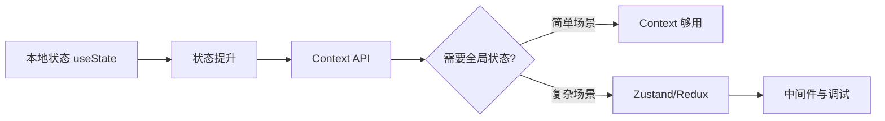

# 状态管理（State Management）

> 什么时候用本地状态、什么时候用全局状态、如何选择状态管理方案

---

## 核心问题

在学习 React 状态管理前，先理解这几个核心问题：

1. **什么是状态？** 组件里会变化的数据（如输入框内容、开关状态、列表数据）
2. **什么时候需要全局状态？** 多个页面/组件要共享数据、数据需要持久化、状态逻辑复杂时
3. **状态管理方案怎么选？** 根据项目规模和复杂度选择：本地状态 → Context → Zustand/Redux

---

## 学习路线



---

## 文档导航

| 文档 | 内容 | 适合人群 |
|------|------|----------|
| [1-基础篇](./1-基础篇.md) | 本地状态、状态提升、Context、何时需要全局状态 | 初学者，掌握基本状态管理 |
| [2-进阶篇](./2-进阶篇.md) | Zustand/Redux 选型、服务端状态 vs 客户端状态、最佳实践 | 中级开发者，掌握复杂场景 |

---

## 快速选型指南

### 什么时候用什么方案？

```typescript
// 场景 1：单组件内的状态 → useState
function Counter() {
  const [count, setCount] = useState(0)
  return <button onClick={() => setCount(count + 1)}>{count}</button>
}

// 场景 2：父子组件共享 → Props 传递
function Parent() {
  const [count, setCount] = useState(0)
  return <Child count={count} onIncrement={() => setCount(count + 1)} />
}

// 场景 3：跨多层组件共享 → Context
const ThemeContext = createContext('light')
function App() {
  return (
    <ThemeContext.Provider value="dark">
      <DeepChild />  {/* 不用层层传 props */}
    </ThemeContext.Provider>
  )
}

// 场景 4：跨页面共享、复杂逻辑 → Zustand/Redux
const useUserStore = create((set) => ({
  user: null,
  login: (user) => set({ user }),
  logout: () => set({ user: null })
}))
```

### 方案对比

| 方案 | 适用场景 | 优点 | 缺点 |
|------|----------|------|------|
| **useState** | 单组件内状态 | 简单直接 | 无法跨组件共享 |
| **Props** | 父子组件通信 | 显式、易追踪 | 层级深时繁琐 |
| **Context** | 跨层级共享（主题、语言、用户信息） | 无需层层传递 | 所有消费者都会重渲染 |
| **Zustand** | 中小型项目全局状态 | 轻量、API 简单 | 生态不如 Redux |
| **Redux** | 大型项目、需要时间旅行调试 | 生态丰富、可预测 | 样板代码多、学习曲线陡 |

---

## 常见问题速查

| 问题 | 答案 | 详见 |
|------|------|------|
| 什么时候状态要提升到父组件？ | 多个子组件要共享同一状态时 | 基础篇 |
| Context 会导致性能问题吗？ | 会，所有消费者都会重渲染。可拆分 Context 或用 useMemo 优化 | 基础篇 |
| Redux 和 Zustand 怎么选？ | 小项目用 Zustand，大项目/需要强约束用 Redux | 进阶篇 |
| 服务端状态（接口数据）用什么管？ | 推荐 React Query/SWR，不要放全局状态 | 进阶篇 |
| 什么是「状态派生」？ | 从已有状态计算出新值，不要重复存储 | 基础篇 |

---

## 学习建议

1. **先掌握本地状态**：熟练使用 `useState`、`useReducer`
2. **理解状态提升**：知道什么时候把状态放父组件
3. **学会用 Context**：解决跨层级传递问题
4. **按需学全局方案**：项目真的需要时再引入 Zustand/Redux
5. **区分状态类型**：服务端状态（接口数据）和客户端状态（UI 状态）分开管理

---

## 面试重点

- [ ] 能说清 useState、Context、Redux 的区别和适用场景
- [ ] 能解释状态提升、单向数据流
- [ ] 知道 Context 的性能问题和优化方法
- [ ] 能对比 Zustand 和 Redux 的优缺点
- [ ] 理解服务端状态 vs 客户端状态

---

_开始学习：[1-基础篇](./1-基础篇.md)_
