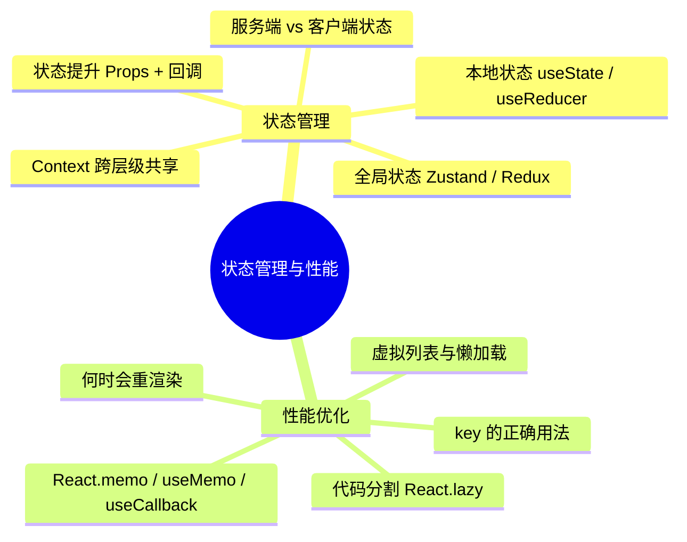

# React 状态管理与性能 · 知识点汇总

> 状态管理决定「数据放哪、怎么更新」；性能优化解决「何时重渲染、如何少算少渲染」。两者常互相影响：状态设计不好会拖慢渲染，优化手段又依赖对状态与渲染的理解。

---

## 一、知识结构总览

---

## 二、状态管理知识点速查

### 2.1 状态类型与选型

| 场景 | 推荐方案 | 说明 |
|------|----------|------|
| 单组件内状态 | `useState` / `useReducer` | 数据只在本组件用，变化要更新 UI |
| 父子组件共享 | 状态提升 + Props | 状态放共同父组件，通过 Props 下传、回调上传 |
| 跨多层共享（主题、语言） | Context API | 避免 Props 层层传递；注意拆分、避免大对象导致全量重渲染 |
| 跨页面 / 复杂逻辑 | Zustand / Redux | 需要可预测、调试或中间件时选 Redux；中小型优先 Zustand |
| 接口数据（列表、详情） | React Query / SWR | 服务端状态，不放进 Redux/Zustand |

### 2.2 核心原则

- **不可变更新**：用新对象/数组替代修改原数据，React 才能检测到变化。
- **单向数据流**：数据从父到子（Props），事件从子到父（回调）。
- **状态派生**：能从已有状态算出来的值不要再存一份状态，直接计算即可；计算重时用 `useMemo`。
- **服务端 vs 客户端**：接口数据用 React Query；UI 状态、跨页面共享用本地/全局状态库。

### 2.3 与性能的关系

- **Context**：value 变化时，所有消费该 Context 的组件都会重渲染 → 拆 Context、用 `useMemo` 包 value、避免频繁变的字段和静态数据混在一起。
- **Zustand/Redux**：细粒度订阅（只取用到的字段）可减少无关组件重渲染。
- **状态提升过高**：状态放在很上层的父组件时，一次更新可能带动整棵子树重渲染 → 配合 `memo`、`useMemo`、`useCallback` 或考虑局部状态/Context 拆分。

---

## 三、性能优化知识点速查

### 3.1 何时会重渲染？

- 组件自身的 **state** 更新。
- 父组件重渲染（默认会带着子组件一起渲染）。
- 组件消费的 **Context** 的 value 变化。
- 使用的 **Zustand/Redux** 等 store 中订阅的那部分状态变化。

**如何验证**：React DevTools Profiler 或在高频组件里加 `console.log` 观察。

### 3.2 优化手段一览

| 手段 | 作用 | 典型场景 |
|------|------|----------|
| **key 稳定且唯一** | 帮助 Diff 识别列表项，避免用 index 导致错位/多余渲染 | 列表渲染，尤其有增删、排序时 |
| **React.memo** | 对 props 做浅比较，相同则跳过子组件重渲染 | 父经常渲染、子 props 多数不变 |
| **useMemo** | 缓存计算结果，依赖不变则复用上次结果 | 重计算、大列表过滤/排序；或稳定对象引用给 memo 子组件 |
| **useCallback** | 缓存函数引用，依赖不变则复用上次函数 | 把回调传给被 memo 的子组件、或作为 useEffect 依赖 |
| **虚拟列表** | 只渲染可见区域 DOM，列表再长也只渲染一屏 | 长列表（成千上万条） |
| **React.lazy + Suspense** | 按需加载组件，减少首屏 bundle | 路由级或大组件懒加载 |
| **useTransition** | 把部分更新标记为低优先级，不阻塞输入等 | 大列表过滤、搜索等高开销更新 |

### 3.3 使用注意

- **不要过早优化**：先保证逻辑正确，再针对卡顿或重渲染过多的组件优化。
- **memo 要配稳定 props**：子组件用 `memo` 但父组件传内联对象/函数，引用每次都是新的，memo 几乎无效 → 用 `useMemo`/`useCallback` 稳定引用。
- **useMemo/useCallback 有成本**：依赖数组比较和闭包也有开销，简单计算、简单回调不必强行包一层。

---

## 四、状态管理 + 性能：常见组合

### 4.1 Context + 性能

- 拆成多个 Context（如主题、用户、语言分开），避免一个 value 包罗万象导致所有消费者一起渲染。
- Provider 的 value 用 `useMemo` 包起来，依赖不变时引用不变，减少下游无谓重渲染。

### 4.2 列表 + key + 虚拟列表

- 列表项用**唯一且稳定**的 id 作 key，不要用 index（尤其会有增删、排序时）。
- 列表特别长时，用虚拟列表（如 react-window）只渲染可见区域。

### 4.3 全局状态 + 细粒度订阅

- Zustand：`useStore(state => state.xxx)` 只订阅用到的字段，该字段没变就不会触发重渲染。
- Redux：`useSelector` 只返回需要的数据，必要时配合 shallowEqual 或 memo 避免引用变化导致重渲染。

---

## 五、文档索引

| 主题 | 文档 | 内容 |
|------|------|------|
| 状态管理 | [StateManagement/1-基础篇](./StateManagement/1-基础篇.md) | 本地状态、状态提升、Context、何时要全局状态 |
| 状态管理 | [StateManagement/2-进阶篇](./StateManagement/2-进阶篇.md) | Zustand/Redux 选型、服务端 vs 客户端状态 |
| 性能优化 | [Performance/1-基础篇](./Performance/1-基础篇.md) | 何时重渲染、key、memo、useMemo、useCallback |
| 性能优化 | [Performance/2-进阶篇](./Performance/2-进阶篇.md) | 虚拟列表、代码分割、React.lazy、useTransition |
| Hooks | [Hooks/2-进阶篇](./Hooks/2-进阶篇.md) | useMemo、useCallback、React.memo 详细用法 |

---

## 六、面试自测要点

**状态管理**

- 能说清 useState、状态提升、Context、Zustand/Redux 的适用场景。
- 能解释「不可变更新」「单向数据流」「状态派生」。
- 知道 Context 的性能问题及优化思路；能区分服务端状态与客户端状态。

**性能**

- 能说明组件何时会重渲染；key 的作用及为什么列表慎用 index。
- 能说明 React.memo、useMemo、useCallback 分别解决什么问题、如何配合使用。
- 知道虚拟列表、代码分割（React.lazy）、useTransition 的典型使用场景。

---

_本文档为「状态管理」与「性能优化」两部分的汇总索引，具体细节以各主题下的基础篇/进阶篇为准。_
