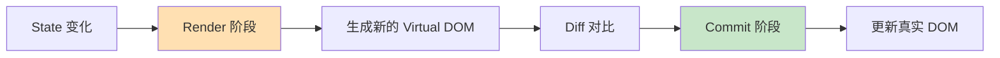
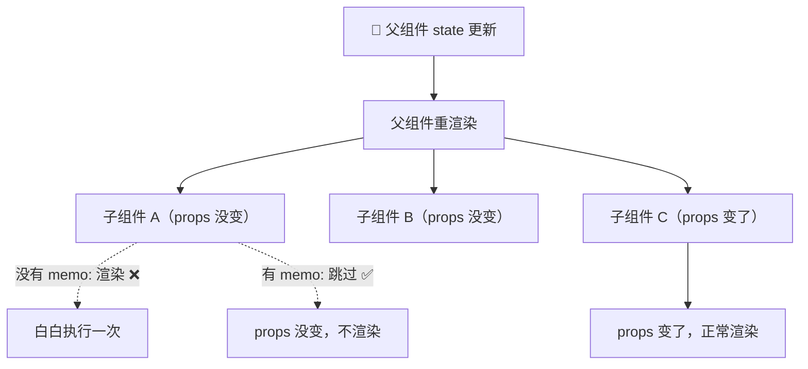

# React 性能优化 · 基础篇

> 性能优化的第一步不是写 `useMemo`，而是搞清楚「为什么慢」。

---

## 1. React 渲染机制：理解"慢"的根源

### 1.1 React 的渲染流程

每次「渲染」并不等于「操作 DOM」。React 的渲染分两个阶段：



| 阶段 | 做什么 | 耗时主因 |
|------|--------|---------|
| **Render 阶段** | 调用组件函数、生成 JSX、Diff 比较 | 组件函数体内的计算量、子组件数量 |
| **Commit 阶段** | 把 Diff 结果写入真实 DOM | DOM 操作量（节点越多越慢） |

**关键认知**：大多数性能问题出在 Render 阶段——不是 DOM 操作慢，而是**不必要的组件函数执行太多了**。

### 1.2 什么时候组件会重新渲染？

```typescript
// 触发重渲染的 4 种情况（从上到下）

// ① 自身 state 更新
const [count, setCount] = useState(0)
setCount(1) // → 本组件重新渲染

// ② 父组件重新渲染（最常见的"冤枉渲染"）
// 父组件 state 变了 → 父组件重渲染 → 所有子组件跟着渲染
// 即使子组件的 props 没有任何变化！

// ③ 消费的 Context value 变化
const theme = useContext(ThemeContext)
// ThemeContext 的 value 变了 → 所有 useContext(ThemeContext) 的组件重渲染

// ④ 订阅的外部 store 变化（Zustand/Redux）
const count = useStore(state => state.count)
// count 变了 → 本组件重渲染
```

**这里是最容易出性能问题的地方**：父组件因为某个和子组件毫无关系的 state 更新了，子组件也被迫重新渲染。当组件树很深、子组件很重时，就会卡顿。

---

## 2. 定位问题：先别急着优化

### 2.1 React DevTools Profiler 实战

> 99% 的性能优化应该从 Profiler 开始，而不是凭感觉加 `memo`。

**安装与打开**：Chrome 安装 React Developer Tools 扩展 → F12 → Profiler 标签

**实际操作步骤**：

```
1. 打开 Profiler → 点击 ⏺ 录制
2. 在页面上执行「卡顿的操作」（比如输入搜索、切换 Tab、滚动列表）
3. 点击 ⏹ 停止录制
4. 查看火焰图（Flamegraph）
```

**火焰图怎么看**：

| 颜色 | 含义 | 你该怎么做 |
|------|------|-----------|
| 🟡 黄色/橙色 | 这个组件渲染了，且耗时较长 | 重点关注，看看能否优化 |
| 🟢 绿色 | 这个组件渲染了，但耗时很短 | 一般不用管 |
| ⚪ 灰色 | 这个组件没有渲染 | 完美，说明跳过了 |

### 2.2 快速定位「谁在重复渲染」

在怀疑有性能问题的组件里加一行日志，是最快的定位方式：

```typescript
function ProductList({ products, category }: Props) {
  // 开发阶段加这行，看控制台输出频率
  console.log('ProductList rendered', { category })

  // 如果切换 Tab 时这里也在输出，说明产生了不必要的渲染
  return (
    <div>
      {products.map(p => <ProductCard key={p.id} product={p} />)}
    </div>
  )
}
```

### 2.3 Profiler 设置技巧

在 React DevTools 设置里打开这两个选项：

- **Highlight updates when components render**：页面上会闪烁高亮重新渲染的组件，直观看到哪些组件在"无意义地抖动"
- **Record why each component rendered**：Profiler 会告诉你每个组件重渲染的原因（props 变了？state 变了？父组件渲染了？）

---

## 3. React.memo：阻断"父渲染→子跟着渲"

### 3.1 解决什么问题



### 3.2 业务场景：后台管理系统的侧边栏

```typescript
// 场景：后台系统，Header 有未读消息数量，每秒轮询更新
// 问题：消息数量变了 → App 重渲染 → Sidebar 也跟着渲染
// Sidebar 包含几十个菜单项 + 图标，每次渲染耗时 15ms+

// ❌ 优化前：每秒都在重渲染 Sidebar
function App() {
  const [msgCount, setMsgCount] = useState(0)
  const [collapsed, setCollapsed] = useState(false)

  useEffect(() => {
    const timer = setInterval(async () => {
      const count = await fetchUnreadCount()
      setMsgCount(count)
    }, 1000)
    return () => clearInterval(timer)
  }, [])

  return (
    <Layout>
      <Header msgCount={msgCount} />
      {/* msgCount 变了 → App 渲染 → Sidebar 也渲染 */}
      <Sidebar collapsed={collapsed} />
      <Content />
    </Layout>
  )
}
```

```typescript
// ✅ 优化后：用 memo 包裹 Sidebar
const Sidebar = memo(function Sidebar({ collapsed }: { collapsed: boolean }) {
  console.log('Sidebar rendered') // 优化后：只有 collapsed 变化时才输出
  
  return (
    <nav>
      {menuItems.map(item => (
        <MenuItem key={item.key} item={item} collapsed={collapsed} />
      ))}
    </nav>
  )
})

// collapsed 是 boolean（原始类型），引用比较天然稳定
// 所以 memo 在这里非常有效：msgCount 变化不再触发 Sidebar 重渲染
```

### 3.3 memo 什么时候没用

```typescript
// ❌ 这样写 memo 等于白加——因为 style 每次都是新对象
const Card = memo(function Card({ style }: { style: React.CSSProperties }) {
  return <div style={style}>...</div>
})

function Parent() {
  return (
    // 每次渲染都创建 { padding: 16 } 新对象，引用不同 → memo 失效
    <Card style={{ padding: 16 }} />
  )
}

// ✅ 方案1：提取为常量（最简单）
const cardStyle = { padding: 16 } // 组件外部定义，引用永远不变
function Parent() {
  return <Card style={cardStyle} />
}

// ✅ 方案2：如果样式依赖 props/state，用 useMemo
function Parent({ spacing }: { spacing: number }) {
  const cardStyle = useMemo(() => ({ padding: spacing }), [spacing])
  return <Card style={cardStyle} />
}
```

### 3.4 memo 使用判断标准

| 场景 | 用不用 memo | 原因 |
|------|------------|------|
| 子组件渲染成本高（几十个 DOM 节点、复杂计算） | ✅ 用 | 每次省下的渲染开销远大于 memo 的比较成本 |
| 父组件频繁更新，但子组件 props 很少变 | ✅ 用 | 大量不必要渲染被阻断 |
| 子组件很轻，就几个 div + 文字 | ❌ 不用 | memo 的浅比较开销可能比重新渲染还大 |
| 子组件的 props 每次都是新引用（内联对象/函数） | ❌ 先稳定引用 | 不先解决引用问题，memo 等于白加 |

---

## 4. useMemo 与 useCallback：稳定引用 + 缓存计算

### 4.1 它们到底解决什么问题

> **useCallback** = 缓存函数引用（让同一个函数不会每次渲染都创建新的）
> **useMemo** = 缓存计算结果（让昂贵的计算不会每次渲染都重算）

两者通常和 `React.memo` 搭配使用。**单独用它们，优化效果几乎为零**。

### 4.2 业务场景：商品列表搜索 + 筛选

```typescript
interface Product {
  id: string
  name: string
  price: number
  category: string
}

function ProductPage() {
  const [products] = useState<Product[]>(mockProducts) // 假设 1000 条
  const [keyword, setKeyword] = useState('')
  const [sortBy, setSortBy] = useState<'price' | 'name'>('price')
  const [selectedId, setSelectedId] = useState<string | null>(null)

  // ✅ useMemo：过滤 + 排序是 O(n log n)，1000 条商品不该每次渲染都算
  const filteredProducts = useMemo(() => {
    console.log('filtering...') // 看这行输出频率来验证是否生效
    return products
      .filter(p => p.name.includes(keyword))
      .sort((a, b) => sortBy === 'price' 
        ? a.price - b.price 
        : a.name.localeCompare(b.name)
      )
  }, [products, keyword, sortBy]) // 只有搜索词或排序方式变了才重新计算

  // ✅ useCallback：传给 memo 子组件的回调，保持引用稳定
  const handleSelect = useCallback((id: string) => {
    setSelectedId(id)
  }, []) // setSelectedId 是稳定的，依赖为空

  return (
    <div>
      <SearchBar value={keyword} onChange={setKeyword} />
      <SortToggle value={sortBy} onChange={setSortBy} />
      {/* ProductCard 被 memo 包裹，handleSelect 引用稳定 → 只有对应商品 props 变了才渲染 */}
      {filteredProducts.map(p => (
        <ProductCard
          key={p.id}
          product={p}
          selected={p.id === selectedId}
          onSelect={handleSelect}
        />
      ))}
    </div>
  )
}
```

```typescript
// ProductCard 用 memo 包裹
const ProductCard = memo(function ProductCard({
  product,
  selected,
  onSelect,
}: {
  product: Product
  selected: boolean
  onSelect: (id: string) => void
}) {
  return (
    <div 
      className={selected ? 'card selected' : 'card'}
      onClick={() => onSelect(product.id)}
    >
      <h3>{product.name}</h3>
      <p>¥{product.price}</p>
    </div>
  )
})
```

**优化效果**：点击选中某个商品时，`selectedId` 变化 → 页面重渲染 → 但只有**前一个选中项**和**新选中项**两个 `ProductCard` 重渲染，其他 998 个跳过。

### 4.3 什么时候不需要 useMemo / useCallback

```typescript
// ❌ 过度优化：简单的字符串拼接没必要 memo
const fullName = useMemo(
  () => `${firstName} ${lastName}`, 
  [firstName, lastName]
)
// ✅ 直接写就行，计算成本几乎为零
const fullName = `${firstName} ${lastName}`

// ❌ 过度优化：回调没有传给 memo 子组件
const handleClick = useCallback(() => {
  setCount(c => c + 1)
}, [])
// ✅ 如果按钮组件没用 memo，useCallback 没有任何意义
const handleClick = () => setCount(c => c + 1)
```

### 4.4 判断标准

| 场景 | useMemo | useCallback |
|------|---------|-------------|
| 计算复杂度 O(n) 以上（过滤、排序、聚合） | ✅ | — |
| 需要把对象/数组传给 memo 子组件 | ✅ 稳定引用 | — |
| 需要把函数传给 memo 子组件 | — | ✅ 稳定引用 |
| 作为 useEffect 的依赖 | ✅ 避免无限循环 | ✅ 避免无限循环 |
| 简单的基本类型计算 | ❌ | — |
| 回调没传给 memo 子组件 | — | ❌ |

---

## 5. 状态设计：从源头减少重渲染

> 很多性能问题不是靠 `memo` 解决的，而是**状态放错了位置**。

### 5.1 状态下移：把 state 放到真正需要它的组件

```typescript
// ❌ 问题写法：hover 状态放在列表层级，hover 任意一项 → 整个列表重渲染
function ProductList({ products }: { products: Product[] }) {
  const [hoveredId, setHoveredId] = useState<string | null>(null)

  return (
    <div>
      {products.map(p => (
        <ProductCard
          key={p.id}
          product={p}
          isHovered={p.id === hoveredId}
          onHover={() => setHoveredId(p.id)}
          onLeave={() => setHoveredId(null)}
        />
      ))}
    </div>
  )
}
```

```typescript
// ✅ 优化：hover 状态下移到 ProductCard 内部，每张卡片管自己的 hover
function ProductList({ products }: { products: Product[] }) {
  // 列表层不再有频繁变化的 state
  return (
    <div>
      {products.map(p => (
        <ProductCard key={p.id} product={p} />
      ))}
    </div>
  )
}

function ProductCard({ product }: { product: Product }) {
  // hover 状态只影响当前卡片，不会触发其他卡片重渲染
  const [isHovered, setIsHovered] = useState(false)

  return (
    <div
      className={isHovered ? 'card hovered' : 'card'}
      onMouseEnter={() => setIsHovered(true)}
      onMouseLeave={() => setIsHovered(false)}
    >
      <h3>{product.name}</h3>
      <p>¥{product.price}</p>
    </div>
  )
}
```

### 5.2 内容提升：把「不变的部分」提取出来

```typescript
// ❌ 问题：ScrollTracker 的 scrollY 每帧都在变 → Header 和 Footer 每帧都在渲染
function Page() {
  const [scrollY, setScrollY] = useState(0)

  useEffect(() => {
    const handler = () => setScrollY(window.scrollY)
    window.addEventListener('scroll', handler)
    return () => window.removeEventListener('scroll', handler)
  }, [])

  return (
    <div>
      <Header />
      <ScrollIndicator scrollY={scrollY} />
      <MainContent />
      <Footer />
    </div>
  )
}
```

```typescript
// ✅ 把频繁变化的部分隔离成独立组件
function Page() {
  // Page 不再有频繁变化的 state → Header / MainContent / Footer 不会被牵连
  return (
    <div>
      <Header />
      <ScrollIndicator /> {/* 频繁变化的 state 封装在内部 */}
      <MainContent />
      <Footer />
    </div>
  )
}

function ScrollIndicator() {
  const [scrollY, setScrollY] = useState(0)
  
  useEffect(() => {
    const handler = () => setScrollY(window.scrollY)
    window.addEventListener('scroll', handler)
    return () => window.removeEventListener('scroll', handler)
  }, [])

  return <div className="indicator" style={{ width: `${scrollY / 10}%` }} />
}
```

### 5.3 避免派生状态冗余

```typescript
// ❌ 反模式：把能计算出来的值存成 state
function OrderSummary({ items }: { items: CartItem[] }) {
  const [total, setTotal] = useState(0)
  const [itemCount, setItemCount] = useState(0)

  // 每次 items 变化都要手动同步 → 容易不一致，且多触发一次渲染
  useEffect(() => {
    setTotal(items.reduce((sum, item) => sum + item.price * item.qty, 0))
    setItemCount(items.reduce((sum, item) => sum + item.qty, 0))
  }, [items])

  return <div>共 {itemCount} 件，合计 ¥{total}</div>
}
```

```typescript
// ✅ 直接计算，不额外存 state（数据量大时再套 useMemo）
function OrderSummary({ items }: { items: CartItem[] }) {
  // 能算出来的值 = 不需要额外 state
  const total = items.reduce((sum, item) => sum + item.price * item.qty, 0)
  const itemCount = items.reduce((sum, item) => sum + item.qty, 0)

  return <div>共 {itemCount} 件，合计 ¥{total}</div>
}
```

---

## 6. key 的正确用法

### 6.1 为什么列表慎用 index 做 key

```typescript
// ❌ 用 index 做 key：往列表头部插入一条数据时
// 插入前：[A(key=0), B(key=1), C(key=2)]
// 插入后：[D(key=0), A(key=1), B(key=2), C(key=3)]
// React 看到 key=0 从 A 变成 D → 认为同一个节点要更新 → 更新所有节点的内容
// 结果：所有节点都被"更新"了，性能白白浪费

// ✅ 用唯一 id 做 key
// 插入前：[A(key=a1), B(key=b1), C(key=c1)]
// 插入后：[D(key=d1), A(key=a1), B(key=b1), C(key=c1)]
// React 看到 key=d1 是新的 → 只创建 D，其他节点不动

// 实际代码
function TodoList({ todos }: { todos: Todo[] }) {
  return (
    <ul>
      {todos.map(todo => (
        // ✅ 用后端返回的唯一 id
        <TodoItem key={todo.id} todo={todo} />
      ))}
    </ul>
  )
}
```

### 6.2 key 的隐藏技巧：强制重置组件状态

```typescript
// 场景：切换用户时，表单需要重置为该用户的数据
// ❌ 用 useEffect 手动重置（代码多、容易漏字段）
function UserForm({ userId }: { userId: string }) {
  const [name, setName] = useState('')
  const [email, setEmail] = useState('')
  
  useEffect(() => {
    // 切换用户时需要手动重置所有字段…
    const user = getUserById(userId)
    setName(user.name)
    setEmail(user.email)
  }, [userId])
  // ...
}

// ✅ 给组件加 key = userId，切换时 React 直接销毁旧组件、创建新组件
function UserPage({ userId }: { userId: string }) {
  return <UserForm key={userId} userId={userId} />
}
```

---

## 7. Context 性能优化

### 7.1 问题：Context 的"全量重渲染"陷阱

```typescript
// ❌ 把所有东西塞一个 Context
interface AppState {
  theme: 'light' | 'dark'
  locale: string
  user: User | null
  notifications: Notification[]  // 每秒都在变
}

// notifications 每秒变一次 → 所有消费 AppContext 的组件每秒都重渲染
// 即使某个组件只用了 theme！
```

### 7.2 解决方案：拆分 Context

```typescript
// ✅ 按变化频率拆分成多个 Context
const ThemeContext = createContext<'light' | 'dark'>('light')
const LocaleContext = createContext('zh-CN')
const UserContext = createContext<User | null>(null)
const NotificationContext = createContext<Notification[]>([])

// 各自独立的 Provider
function AppProviders({ children }: { children: React.ReactNode }) {
  const [theme, setTheme] = useState<'light' | 'dark'>('light')
  const [notifications, setNotifications] = useState<Notification[]>([])

  return (
    <ThemeContext.Provider value={theme}>
      <NotificationContext.Provider value={notifications}>
        {children}
      </NotificationContext.Provider>
    </ThemeContext.Provider>
  )
}

// 现在：notifications 变化只影响消费 NotificationContext 的组件
// theme 变化只影响消费 ThemeContext 的组件，互不干扰
```

### 7.3 Provider value 稳定化

```typescript
// ❌ 每次渲染都创建新对象 → 下游所有消费者都重渲染
function AuthProvider({ children }: { children: React.ReactNode }) {
  const [user, setUser] = useState<User | null>(null)

  return (
    // { user, setUser } 每次渲染都是新引用！
    <AuthContext.Provider value={{ user, setUser }}>
      {children}
    </AuthContext.Provider>
  )
}

// ✅ 用 useMemo 稳定 value 引用
function AuthProvider({ children }: { children: React.ReactNode }) {
  const [user, setUser] = useState<User | null>(null)
  
  const value = useMemo(() => ({ user, setUser }), [user])
  // setUser 引用稳定不需要放依赖，user 没变 → value 引用不变 → 下游不重渲染

  return (
    <AuthContext.Provider value={value}>
      {children}
    </AuthContext.Provider>
  )
}
```

---

## 8. 实用优化清单

### 8.1 优化优先级（从高到低）

| 优先级 | 优化手段 | 代价 | 收益 |
|--------|---------|------|------|
| 🥇 | 状态下移 / 内容提升（重构组件结构） | 低 | 高 |
| 🥇 | 避免派生状态冗余 | 低 | 中 |
| 🥈 | Context 拆分 | 中 | 高 |
| 🥈 | React.memo + 稳定 props | 中 | 高 |
| 🥉 | useMemo 缓存重计算 | 低 | 视计算量 |
| 🥉 | useCallback 稳定回调引用 | 低 | 配合 memo 才有效 |

### 8.2 优化前的自检清单

```
□ 用 Profiler 确认了瓶颈组件？（而不是凭感觉）
□ 确认是「不必要的重渲染」导致的？（而不是首次渲染本身就慢）
□ 先试了「状态下移」或「内容提升」？（成本最低）
□ 如果加 memo，确认 props 引用是稳定的？
□ useMemo/useCallback 有配合 memo 子组件使用？
□ 优化后在 Profiler 里验证了效果？
```

---

## 9. 面试检验

**Q1：React 组件什么时候会重新渲染？如何避免不必要的重渲染？**

> 4 种触发情况：自身 state 变化、父组件重渲染、消费的 Context value 变化、订阅的外部 store 变化。
> 
> 避免不必要渲染：优先调整组件结构（状态下移、内容提升），其次用 React.memo 配合 useMemo/useCallback 稳定 props 引用。

**Q2：useMemo 和 useCallback 有什么区别？什么时候不需要它们？**

> useMemo 缓存计算结果，useCallback 缓存函数引用。它们通常要配合 React.memo 才有意义。
> 
> 不需要的情况：计算很轻（简单运算、字符串拼接）、回调没有传给被 memo 的子组件。

**Q3：你在实际项目中做过哪些性能优化？**

> 回答思路：描述问题现象 → 如何定位（Profiler）→ 分析原因 → 选择方案 → 量化结果。
> 
> 例如：后台系统侧边栏因消息轮询导致每秒重渲染，通过 Profiler 发现 Sidebar 每次渲染耗时 18ms，用 React.memo 包裹后降为 0ms（跳过渲染），页面整体 FPS 从 45 恢复到 60。

**Q4：为什么不推荐给所有组件都加 React.memo？**

> memo 有浅比较的开销。对于轻量组件（几个 div + 文字），比较 props 的成本可能比直接重新渲染还高。另外如果 props 引用不稳定，memo 每次比较都通不过，完全是多余开销。

**Q5：除了 memo 系列，还有什么方式可以减少重渲染？**

> 状态下移（把 state 放到真正需要的子组件中）、内容提升（把不依赖频繁变化 state 的组件提取到上层）、拆分 Context、避免派生状态冗余。这些是成本最低、效果最好的方案。

---

_下一篇：[进阶篇](./2-进阶篇.md) — 虚拟列表、代码分割、React 18 并发特性、Bundle 优化、真实项目案例_
