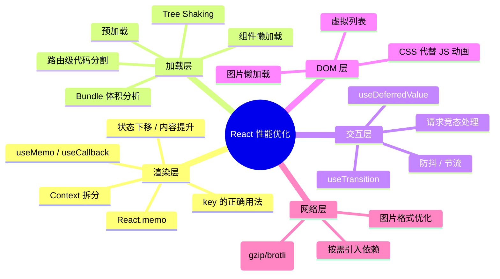

# React 性能优化 · 进阶篇

> 基础篇解决了「渲染层」的问题，进阶篇解决「加载层」「交互层」「架构层」的问题。

---

## 1. 虚拟列表：DOM 太多是性能杀手

### 1.1 为什么长列表会卡

```
渲染 100 个 DOM 节点 → 流畅
渲染 1,000 个 DOM 节点 → 开始卡顿
渲染 10,000 个 DOM 节点 → 页面假死

原因不是 React 慢，而是浏览器处理大量 DOM 的布局、绘制、事件绑定都很重
```

**实际场景**：后台日志列表、聊天记录、商品瀑布流、数据表格——这些场景数据量轻松过千。

### 1.2 虚拟列表原理


核心思想：**不管数据有多少条，DOM 永远只有一屏的量**。通过监听滚动位置，动态计算当前应该显示哪些数据。

### 1.3 业务实战：react-window 接入

```bash
npm install react-window
npm install -D @types/react-window
```

```typescript
import { FixedSizeList } from 'react-window'

interface LogItem {
  id: string
  timestamp: string
  level: 'info' | 'warn' | 'error'
  message: string
}

// 场景：运维后台的日志列表，动辄上万条
function LogViewer({ logs }: { logs: LogItem[] }) {
  // 每一行的渲染函数
  const Row = ({ index, style }: { index: number; style: React.CSSProperties }) => {
    const log = logs[index]
    return (
      <div style={style} className={`log-row log-${log.level}`}>
        <span className="time">{log.timestamp}</span>
        <span className="level">{log.level.toUpperCase()}</span>
        <span className="msg">{log.message}</span>
      </div>
    )
  }

  return (
    <FixedSizeList
      height={600}         // 容器高度
      width="100%"         // 容器宽度
      itemCount={logs.length}  // 总数据量
      itemSize={36}        // 每行高度（固定）
      overscanCount={5}    // 可见区域外额外渲染 5 行，减少滚动白屏
    >
      {Row}
    </FixedSizeList>
  )
}
// 效果：10,000 条日志，DOM 只有 ~25 个节点，滚动丝滑
```

### 1.4 动态高度列表

实际业务中，列表项高度往往不固定（比如聊天消息、评论列表）：

```typescript
import { VariableSizeList } from 'react-window'

function ChatMessages({ messages }: { messages: Message[] }) {
  const listRef = useRef<VariableSizeList>(null)
  
  // 根据消息内容估算高度（实际项目中可能需要更精确的计算）
  const getItemSize = (index: number) => {
    const msg = messages[index]
    const lineCount = Math.ceil(msg.content.length / 40) // 每行约 40 字
    return Math.max(60, lineCount * 24 + 32) // 最小高度 60px
  }

  // 新消息来了，滚动到底部
  useEffect(() => {
    listRef.current?.scrollToItem(messages.length - 1, 'end')
  }, [messages.length])

  const Row = ({ index, style }: { index: number; style: React.CSSProperties }) => (
    <div style={style}>
      <ChatBubble message={messages[index]} />
    </div>
  )

  return (
    <VariableSizeList
      ref={listRef}
      height={500}
      width="100%"
      itemCount={messages.length}
      itemSize={getItemSize}
      overscanCount={3}
    >
      {Row}
    </VariableSizeList>
  )
}
```

### 1.5 虚拟列表 vs 分页 vs 无限滚动

| 方案 | 适用场景 | 优点 | 缺点 |
|------|---------|------|------|
| **虚拟列表** | 数据量大、需要流畅滚动 | DOM 少、滚动流畅 | 实现复杂、搜索/定位需要额外处理 |
| **分页** | 数据量大、不需要连续浏览 | 实现简单、SEO 友好 | 用户体验中断（点击换页） |
| **无限滚动** | 社交信息流、瀑布流 | 体验好、实现中等 | DOM 持续增长、内存逐渐膨胀 |

---

## 2. 代码分割：减少首屏加载量

### 2.1 问题：Bundle 越来越大

```
你的项目可能长这样：
  bundle.js → 2.8MB（gzip 后 800KB）
  
用户打开首页，需要加载整个 2.8MB 的 JS
但首页可能只用了其中 200KB 的代码
剩下的 2.6MB 是「用户设置」「数据报表」「管理后台」等页面的代码
```

### 2.2 路由级代码分割（最常用）

```typescript
import { lazy, Suspense } from 'react'
import { Routes, Route } from 'react-router-dom'

// ✅ 路由级懒加载：每个页面独立打包，访问时才下载
const Dashboard = lazy(() => import('./pages/Dashboard'))
const UserManage = lazy(() => import('./pages/UserManage'))
const DataReport = lazy(() => import('./pages/DataReport'))
const Settings = lazy(() => import('./pages/Settings'))

function App() {
  return (
    <Suspense fallback={<PageSkeleton />}>
      <Routes>
        <Route path="/" element={<Dashboard />} />
        <Route path="/users" element={<UserManage />} />
        <Route path="/report" element={<DataReport />} />
        <Route path="/settings" element={<Settings />} />
      </Routes>
    </Suspense>
  )
}

// 骨架屏比 Loading... 体验更好
function PageSkeleton() {
  return (
    <div className="skeleton-container">
      <div className="skeleton-header" />
      <div className="skeleton-content" />
    </div>
  )
}
```

**效果**：首页只加载 Dashboard 的代码，其他页面的代码在用户点击导航时才下载。

### 2.3 组件级代码分割（大组件懒加载）

```typescript
// 场景：数据报表页面有一个很重的图表组件（ECharts/Chart.js），
// 但用户可能只看列表不看图表

function ReportPage() {
  const [showChart, setShowChart] = useState(false)
  
  // ✅ 图表组件懒加载：点击「查看图表」时才下载 echarts 相关代码
  const ChartPanel = lazy(() => import('./components/ChartPanel'))

  return (
    <div>
      <DataTable data={reportData} />
      <button onClick={() => setShowChart(true)}>查看图表</button>
      {showChart && (
        <Suspense fallback={<div>图表加载中...</div>}>
          <ChartPanel data={reportData} />
        </Suspense>
      )}
    </div>
  )
}
```

### 2.4 预加载：提前加载即将用到的代码

```typescript
// 场景：用户 hover 到导航菜单时，预加载目标页面的代码
// 等用户真的点击时，代码已经下载好了，无需等待

const UserManage = lazy(() => import('./pages/UserManage'))

function NavItem() {
  const navigate = useNavigate()
  
  // 鼠标悬停时提前加载
  const handleMouseEnter = () => {
    import('./pages/UserManage') // 提前触发下载，浏览器会缓存
  }

  return (
    <div
      onMouseEnter={handleMouseEnter}
      onClick={() => navigate('/users')}
    >
      用户管理
    </div>
  )
}
```

---

## 3. React 18 并发特性：让页面"不卡"

### 3.1 问题：大量计算阻塞交互

```
用户在搜索框输入 → 触发 10,000 条数据过滤和列表渲染
在过滤和渲染完成之前（假设 200ms），输入框无法响应用户继续输入
用户感觉：输入卡顿、延迟、反应慢
```

### 3.2 useTransition：标记低优先级更新

```typescript
import { useState, useTransition } from 'react'

function SearchableList({ allItems }: { allItems: string[] }) {
  const [keyword, setKeyword] = useState('')
  const [filteredItems, setFilteredItems] = useState(allItems)
  const [isPending, startTransition] = useTransition()

  const handleSearch = (value: string) => {
    // ✅ 输入框立即响应（高优先级）
    setKeyword(value)

    // ✅ 列表过滤标记为低优先级，不阻塞输入
    startTransition(() => {
      const filtered = allItems.filter(item =>
        item.toLowerCase().includes(value.toLowerCase())
      )
      setFilteredItems(filtered)
    })
  }

  return (
    <div>
      <input
        value={keyword}
        onChange={e => handleSearch(e.target.value)}
        placeholder="搜索..."
      />
      {/* isPending 为 true 时，可以显示加载指示 */}
      <div style={{ opacity: isPending ? 0.6 : 1 }}>
        {filteredItems.map(item => (
          <div key={item}>{item}</div>
        ))}
      </div>
    </div>
  )
}
```

**核心原理**：React 18 把 `startTransition` 里的更新标记为"可中断"。如果用户继续输入，React 会放弃正在进行的低优先级渲染，优先处理输入。

### 3.3 useDeferredValue：延迟渲染"重"的部分

```typescript
import { useState, useDeferredValue, memo } from 'react'

function ProductSearch() {
  const [keyword, setKeyword] = useState('')
  // keyword 每次输入立即更新
  // deferredKeyword 会"延后"更新，不阻塞输入
  const deferredKeyword = useDeferredValue(keyword)

  return (
    <div>
      <input
        value={keyword}
        onChange={e => setKeyword(e.target.value)}
        placeholder="搜索商品..."
      />
      {/* 用 deferredKeyword 渲染列表，输入时列表可以"慢半拍"更新 */}
      <ProductResults keyword={deferredKeyword} />
    </div>
  )
}

// 这个组件渲染成本很高（大量商品卡片）
const ProductResults = memo(function ProductResults({ keyword }: { keyword: string }) {
  const filtered = useExpensiveFilter(keyword) // 假设这是个耗时操作
  return (
    <div>
      {filtered.map(p => <ProductCard key={p.id} product={p} />)}
    </div>
  )
})
```

### 3.4 useTransition vs useDeferredValue

| 特性 | useTransition | useDeferredValue |
|------|--------------|------------------|
| **控制粒度** | 控制"哪次 setState 是低优先级" | 控制"哪个值延迟更新" |
| **使用场景** | 你能控制 setState 的地方 | 你拿到的是 props/外部值，控制不了何时更新 |
| **典型用法** | 搜索过滤、Tab 切换内容 | 接收父组件传来的搜索词、渲染重组件 |
| **额外能力** | `isPending` 状态，可显示 loading | 无 pending 状态 |

---

## 4. 网络层优化：减少无效请求

### 4.1 防抖搜索：不要每个字符都发请求

```typescript
import { useState, useEffect, useRef } from 'react'

// 自定义 Hook：防抖值
function useDebouncedValue<T>(value: T, delay: number): T {
  const [debouncedValue, setDebouncedValue] = useState(value)

  useEffect(() => {
    const timer = setTimeout(() => setDebouncedValue(value), delay)
    return () => clearTimeout(timer)
  }, [value, delay])

  return debouncedValue
}

// 使用：搜索框
function SearchBox() {
  const [keyword, setKeyword] = useState('')
  const debouncedKeyword = useDebouncedValue(keyword, 300)

  // 只有停止输入 300ms 后才发请求
  useEffect(() => {
    if (!debouncedKeyword) return
    searchProducts(debouncedKeyword).then(setResults)
  }, [debouncedKeyword])

  return <input value={keyword} onChange={e => setKeyword(e.target.value)} />
}
```

### 4.2 请求竞态处理：避免旧请求覆盖新结果

```typescript
// 场景：用户快速输入 "ab" → "abc" → "abcd"
// 三个请求几乎同时发出，但 "ab" 的响应可能最后到达
// 如果不处理竞态，页面最终显示的是 "ab" 的结果而非 "abcd"

function useSearch(keyword: string) {
  const [results, setResults] = useState<Product[]>([])
  const [loading, setLoading] = useState(false)

  useEffect(() => {
    if (!keyword) { setResults([]); return }

    let cancelled = false // 竞态标记
    setLoading(true)

    searchProducts(keyword).then(data => {
      // 如果这个请求已经被"取消"（新的请求已经发出），忽略结果
      if (!cancelled) {
        setResults(data)
        setLoading(false)
      }
    })

    // 清理函数：下一次 effect 执行前，标记上一次为已取消
    return () => { cancelled = true }
  }, [keyword])

  return { results, loading }
}
```

### 4.3 用 AbortController 真正取消请求

```typescript
function useSearch(keyword: string) {
  const [results, setResults] = useState<Product[]>([])

  useEffect(() => {
    if (!keyword) return

    const controller = new AbortController()

    fetch(`/api/search?q=${keyword}`, { signal: controller.signal })
      .then(res => res.json())
      .then(setResults)
      .catch(err => {
        // AbortError 是正常取消，不需要处理
        if (err.name !== 'AbortError') console.error(err)
      })

    // 关键：新请求发出时，取消上一个还在飞行中的请求
    return () => controller.abort()
  }, [keyword])

  return results
}
```

---

## 5. Bundle 体积分析与优化

### 5.1 分析你的 Bundle

```bash
# Vite 项目
npm install -D rollup-plugin-visualizer

# 在 vite.config.ts 中
import { visualizer } from 'rollup-plugin-visualizer'

export default defineConfig({
  plugins: [
    react(),
    visualizer({
      open: true,         // 构建后自动打开分析页面
      gzipSize: true,     // 显示 gzip 后体积
      filename: 'stats.html'
    })
  ]
})
```

```bash
# 构建后查看
npm run build
# 自动打开 stats.html，可以看到每个依赖占多大
```

### 5.2 常见体积杀手与解决方案

| 依赖 | 典型体积 | 优化方案 |
|------|---------|---------|
| **moment.js** | ~300KB | 换成 dayjs（~2KB），API 几乎一致 |
| **lodash** | ~70KB（全量引入） | 按需引入：`import debounce from 'lodash/debounce'` |
| **echarts** | ~800KB | 按需引入模块；或懒加载图表组件 |
| **antd** | ~200KB | Vite 已支持 Tree Shaking，确保用 ES Module 引入 |
| **不用的 polyfill** | 不定 | 检查 browserslist 配置，只 polyfill 目标浏览器需要的 |

### 5.3 按需引入实战

```typescript
// ❌ 全量引入 lodash：打包了整个 70KB 的库
import _ from 'lodash'
const result = _.debounce(fn, 300)

// ✅ 只引入需要的函数：只打包 ~1KB
import debounce from 'lodash/debounce'
const result = debounce(fn, 300)

// ✅ 更好的方案：用 lodash-es（支持 Tree Shaking）
import { debounce } from 'lodash-es'
```

```typescript
// ❌ 全量引入 ECharts
import * as echarts from 'echarts'

// ✅ 按需引入
import * as echarts from 'echarts/core'
import { BarChart } from 'echarts/charts'
import { GridComponent, TooltipComponent } from 'echarts/components'
import { CanvasRenderer } from 'echarts/renderers'

echarts.use([BarChart, GridComponent, TooltipComponent, CanvasRenderer])
// 只打包了用到的图表类型和组件，体积减少 60%+
```

### 5.4 Tree Shaking 生效的前提

```typescript
// Tree Shaking = 打包工具自动移除「没有用到的导出」
// 前提条件：
// 1. 使用 ES Module（import/export），不能用 CommonJS（require）
// 2. 代码没有副作用（或在 package.json 中标记了 sideEffects）
// 3. 打包工具在 production 模式下运行

// ✅ 这样写，未使用的 formatCurrency 会被 Tree Shaking 移除
import { formatDate } from './utils'

// ❌ 这样写，整个 utils 都会被打包
import * as utils from './utils'
```

---

## 6. 图片与资源优化

### 6.1 图片懒加载

```typescript
// 现代浏览器原生支持 loading="lazy"
function ProductImage({ src, alt }: { src: string; alt: string }) {
  return (
    
  )
}
```

### 6.2 选择合适的图片格式

| 格式 | 适用场景 | 体积对比（同质量） |
|------|---------|-------------------|
| **WebP** | 通用照片、商品图 | 比 JPEG 小 25-30% |
| **AVIF** | 需要极致压缩 | 比 WebP 再小 20% |
| **SVG** | 图标、Logo | 极小，且可缩放 |
| **PNG** | 需要透明背景 | 体积较大，慎用大图 |

```html
<!-- 渐进增强：浏览器按顺序尝试，用第一个支持的格式 -->
<picture>
  <source srcset="product.avif" type="image/avif" />
  <source srcset="product.webp" type="image/webp" />
  
</picture>
```

---

## 7. 内存泄漏防范

### 7.1 常见泄漏场景

```typescript
// ❌ 泄漏1：组件卸载后还在 setState
function Notifications() {
  const [data, setData] = useState<Notification[]>([])

  useEffect(() => {
    const timer = setInterval(async () => {
      const result = await fetchNotifications()
      setData(result) // 组件已卸载，但 interval 还在跑 → 内存泄漏 + 控制台警告
    }, 5000)
    
    // ✅ 修复：清理定时器
    return () => clearInterval(timer)
  }, [])
  // ...
}
```

```typescript
// ❌ 泄漏2：WebSocket/EventSource 没关闭
function LivePrice({ symbol }: { symbol: string }) {
  const [price, setPrice] = useState(0)

  useEffect(() => {
    const ws = new WebSocket(`wss://api.example.com/price/${symbol}`)
    ws.onmessage = (event) => {
      setPrice(JSON.parse(event.data).price)
    }

    // ✅ 修复：组件卸载时关闭连接
    return () => ws.close()
  }, [symbol])
  // ...
}
```

```typescript
// ❌ 泄漏3：全局事件监听没移除
function WindowSize() {
  const [width, setWidth] = useState(window.innerWidth)

  useEffect(() => {
    // 用具名函数，确保 add 和 remove 是同一个引用
    const handleResize = () => setWidth(window.innerWidth)
    window.addEventListener('resize', handleResize)

    // ✅ 修复：移除同一个函数引用
    return () => window.removeEventListener('resize', handleResize)
  }, [])
  // ...
}
```

### 7.2 检测内存泄漏

```
Chrome DevTools → Memory 标签 → Take heap snapshot
1. 页面初始状态：拍一个快照
2. 执行疑似泄漏的操作（反复进入/离开某个页面）
3. 再拍一个快照
4. 对比两个快照，看「Detached DOM」和「Array/Object」数量是否持续增长
```

---

## 8. 真实项目优化案例

### 案例一：电商后台商品列表页（首屏 4s → 1.2s）

**问题描述**：
- 商品管理页面首屏加载需要 4 秒
- 页面有 3 个重度图表组件（ECharts）+ 一个 500 行的商品表格

**定位过程**：
```
1. Chrome Network 标签 → bundle.js 1.8MB（gzip 后 560KB）
2. rollup-plugin-visualizer 分析 → ECharts 占了 680KB
3. Profiler 显示表格组件首次渲染耗时 380ms
```

**优化方案**：
```
✅ 第一步：路由级代码分割（效果最大）
   - 把 Dashboard、UserManage、Settings 等页面 lazy 加载
   - 首屏 bundle 从 1.8MB → 600KB

✅ 第二步：图表组件懒加载 + ECharts 按需引入
   - 图表放在「查看报表」Tab 下，切换 Tab 时才加载
   - ECharts 按需引入，只引入 Bar + Line + Pie
   - 图表相关代码从 680KB → 180KB

✅ 第三步：商品表格虚拟化
   - 用 react-window 替换原生表格
   - 表格 DOM 从 500+ 行 → 始终 ~20 行
   - 首次渲染从 380ms → 45ms

✅ 第四步：图片 WebP 格式 + 懒加载
   - 商品缩略图换成 WebP，体积减少 30%
   - 不在视口内的图片 loading="lazy"
```

**结果**：首屏加载 4s → 1.2s，Lighthouse Performance 评分从 42 → 87。

### 案例二：搜索筛选交互卡顿（输入延迟 300ms → 即时响应）

**问题描述**：
- 商品搜索框输入时明显卡顿
- 输入一个字符要等 200-300ms 才能看到

**定位过程**：
```
1. Profiler 录制输入过程 → 每次输入触发整个列表重新过滤 + 渲染
2. 列表有 2000 条商品，每条有价格、标签等复杂展示
3. 过滤 + 渲染总耗时 ~250ms，阻塞了输入框的响应
```

**优化方案**：
```typescript
function ProductSearch({ products }: { products: Product[] }) {
  const [keyword, setKeyword] = useState('')
  const [isPending, startTransition] = useTransition()

  // 拆分：输入立即响应 vs 列表延迟更新
  const handleInput = (value: string) => {
    setKeyword(value)  // 高优先级：输入框立即更新
    startTransition(() => {
      setFilterKeyword(value) // 低优先级：列表可以晚一点更新
    })
  }

  const [filterKeyword, setFilterKeyword] = useState('')

  const filteredProducts = useMemo(
    () => products.filter(p => p.name.includes(filterKeyword)),
    [products, filterKeyword]
  )

  return (
    <div>
      <input value={keyword} onChange={e => handleInput(e.target.value)} />
      <div style={{ opacity: isPending ? 0.7 : 1 }}>
        <VirtualizedProductList items={filteredProducts} />
      </div>
    </div>
  )
}
```

**结果**：输入响应从 300ms 延迟 → 即时响应（< 16ms），列表更新有 50-100ms 的延迟但用户无感。

### 案例三：后台 Dashboard 频繁轮询导致页面抖动

**问题描述**：
- Dashboard 有 5 个数据卡片，每 3 秒轮询更新
- 每次轮询整个页面都在"闪"，侧边栏和顶部导航也跟着重渲染

**定位过程**：
```
1. 打开 React DevTools 的 Highlight updates → 每 3 秒整个页面都在闪
2. 原因：轮询数据的 state 放在最顶层的 App 组件
3. App 重渲染 → Sidebar + Header + Footer 全部跟着渲染
```

**优化方案**：
```typescript
// ✅ 方案1：状态下移 — 把轮询逻辑封装到 Dashboard 内部
function Dashboard() {
  const { data, loading } = usePollingData('/api/dashboard', 3000)
  return (
    <div className="dashboard">
      {data.cards.map(card => (
        <StatCard key={card.id} {...card} />
      ))}
    </div>
  )
}

// ✅ 方案2：用 Zustand 细粒度状态管理（如果多个页面都需要这些数据）
const useDashboardStore = create<DashboardStore>((set) => ({
  cards: [],
  fetchCards: async () => {
    const data = await fetch('/api/dashboard').then(r => r.json())
    set({ cards: data.cards })
  },
}))

// 只有订阅了 cards 的组件才会重渲染，Sidebar 和 Header 完全不受影响
function StatCard({ id }: { id: string }) {
  const card = useDashboardStore(state => 
    state.cards.find(c => c.id === id)
  )
  if (!card) return null
  return <div className="stat-card">{card.value}</div>
}
```

**结果**：Sidebar 和 Header 从每 3 秒渲染一次 → 完全不渲染，页面不再"抖动"。

---

## 9. 性能优化思维框架

### 9.1 性能问题三问

```
遇到性能问题时，按顺序问自己：

Q1: 是「加载慢」还是「交互慢」？
    → 加载慢：看 Bundle 体积、代码分割、资源加载
    → 交互慢：看重渲染、计算量、DOM 数量

Q2: 瓶颈在哪？用什么工具定位？
    → 渲染问题：React Profiler
    → 网络问题：Chrome Network 标签
    → Bundle 问题：rollup-plugin-visualizer
    → 内存问题：Chrome Memory 标签

Q3: 选什么方案？成本和收益如何？
    → 优先选成本低、收益高的方案（状态重构 > memo > 虚拟列表）
    → 每次优化后用数据验证效果
```

### 9.2 性能优化全景图



---

## 10. 面试检验

**Q1：你在项目中是如何进行性能优化的？请描述完整的优化过程。**

> 回答框架：发现问题（用户反馈/自测）→ 量化问题（Profiler/Lighthouse 得分/FPS）→ 定位瓶颈（具体是哪个组件/哪个资源）→ 选择方案 → 实施 → 验证数据（优化前后对比）。千万别上来就说"我加了 useMemo"。

**Q2：useTransition 和 useDeferredValue 分别解决什么问题？实际场景是什么？**

> useTransition 把某次 setState 标记为低优先级，常用于搜索过滤、Tab 切换等场景。useDeferredValue 让某个值"延迟更新"，常用于接收外部 props 时控制重组件的渲染频率。两者核心目的一样：让高优先级更新（输入响应）不被低优先级更新（列表渲染）阻塞。

**Q3：一个后台系统首屏加载需要 5 秒，你会怎么优化？**

> 分层排查：
> 1. 网络层：看 Network，检查是否有大体积 JS/CSS/图片
> 2. Bundle 层：用 visualizer 分析哪些依赖占体积大 → 按需引入或替换
> 3. 加载层：路由级代码分割，首页只加载首页代码
> 4. 渲染层：首屏不需要的组件懒加载（图表、弹窗）
> 5. 资源层：图片 WebP + 懒加载，开启 gzip/brotli 压缩

**Q4：虚拟列表的原理是什么？什么时候该用？**

> 原理：只渲染可视区域内的 DOM 节点，通过监听滚动事件动态替换可见内容，用 CSS 撑起总高度让滚动条正常。适用于数据量大（几百到上万条）且需要连续滚动的场景，如日志列表、聊天记录、大数据表格。

**Q5：如何避免 React 项目中的内存泄漏？**

> 三个重点：① useEffect 的清理函数必须取消定时器、关闭 WebSocket、移除事件监听；② 异步操作（fetch/setTimeout）在组件卸载后不要 setState，可用 AbortController 或 cancelled 标记；③ 大对象用完后解除引用，避免闭包持有不需要的数据。

---

_本篇配合 [基础篇](./1-基础篇.md) 使用效果最佳。建议先用 Profiler 在自己的项目中找到真实瓶颈，再对照本文选择优化方案。_
