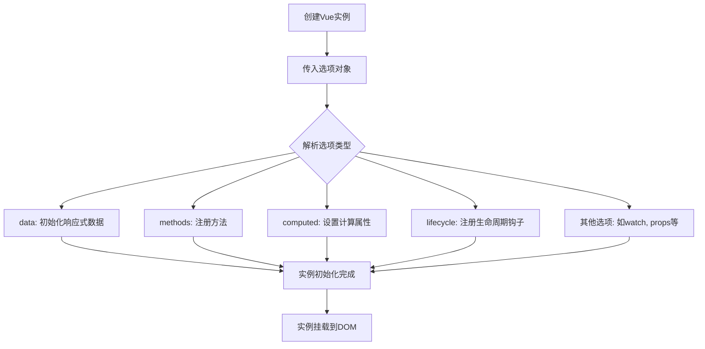

# Vue实例与选项对象 (Vue Instance and Options Object)

## 1. 解决什么问题？

> 创建可复用的、功能完整的Vue组件实例

* **痛点**：如何在Vue框架中创建一个具有响应式数据、方法和生命周期的应用实例？
* **作用**：通过选项对象配置，快速创建具备完整功能的Vue实例。

## 2. 通俗理解

### 核心定义
Vue实例是Vue应用程序的基本组成部分，通过`createApp()`创建。选项对象是一组参数，用来配置实例的行为，包括数据、方法、计算属性和生命周期钩子。

### 生活化比喻
如果把Vue组件比作一台定制电脑，那么选项对象就像是订购时的选择清单。你在清单上标明需要多少内存(data)、安装哪些软件(methods)、配置什么样的处理器(computed)，以及电脑开关机时要执行的操作(lifecycle hooks)。

## 3. 工作原理



## 4. 核心代码实战

### 业务场景
让我们创建一个购物车组件实例，用于展示商品列表、管理数量和计算总价。

### Vue 3 写法
```javascript
import { createApp } from 'vue'

const app = createApp({
  // 数据选项：定义响应式状态
  data() {
    return {
      products: [
        { id: 1, name: '苹果', price: 5, quantity: 1 },
        { id: 2, name: '香蕉', price: 3, quantity: 2 }
      ],
      discount: 0.1 // 折扣率
    }
  },

  // 方法选项：定义事件处理器和普通方法
  methods: {
    // 增加商品数量
    incrementQuantity(productId) {
      const product = this.products.find(p => p.id === productId)
      if (product) {
        product.quantity++
      }
    },

    // 减少商品数量
    decrementQuantity(productId) {
      const product = this.products.find(p => p.id === productId)
      if (product && product.quantity > 1) {
        product.quantity--
      }
    },

    // 删除商品
    removeProduct(productId) {
      this.products = this.products.filter(p => p.id !== productId)
    },

    // 应用折扣
    applyDiscount(newDiscount) {
      this.discount = newDiscount
    }
  },

  // 计算属性：基于响应式依赖进行计算
  computed: {
    // 计算总价格
    totalPrice() {
      const sum = this.products.reduce((total, product) => {
        return total + (product.price * product.quantity)
      }, 0)

      // 返回折后价格
      return sum * (1 - this.discount)
    },

    // 统计商品总数
    totalItems() {
      return this.products.reduce((count, product) => {
        return count + product.quantity
      }, 0)
    },

    // 检查是否为空购物车
    isEmpty() {
      return this.products.length === 0
    }
  },

  // 生命周期钩子：在特定时间点执行代码
  created() {
    // 实例创建后立即执行
    console.log('购物车实例已创建')
    console.log('初始商品数量:', this.totalItems)
  },

  mounted() {
    // DOM挂载完成后执行
    console.log('购物车组件已挂载到页面')
  },

  updated() {
    // 数据更新导致DOM重新渲染后执行
    console.log('购物车UI已更新')
  },

  // 监听器：监听数据变化
  watch: {
    products: {
      handler(newProducts, oldProducts) {
        console.log('购物车内容发生变化')
        // 性能优化：仅在深层变化时触发
      },
      deep: true // 深度监听
    }
  }
})

// 挂载应用到DOM元素
app.mount('#shopping-cart')
```

### Vue 2 对比
```javascript
// Vue 2 写法对比
new Vue({
  el: '#shopping-cart',
  // Vue 2 中使用 el 选项指定挂载元素
  data: {
    // Vue 2 中 data 是对象而非函数（在根实例中）
    // 注意：在组件中 data 必须是函数
    products: [
      { id: 1, name: '苹果', price: 5, quantity: 1 },
      { id: 2, name: '香蕉', price: 3, quantity: 2 }
    ],
    discount: 0.1
  },

  methods: {
    incrementQuantity(productId) {
      const product = this.products.find(p => p.id === productId)
      if (product) {
        product.quantity++
      }
    },
    decrementQuantity(productId) {
      const product = this.products.find(p => p.id === productId)
      if (product && product.quantity > 1) {
        product.quantity--
      }
    },
    removeProduct(productId) {
      this.products = this.products.filter(p => p.id !== productId)
    },
    applyDiscount(newDiscount) {
      this.discount = newDiscount
    }
  },

  computed: {
    totalPrice() {
      const sum = this.products.reduce((total, product) => {
        return total + (product.price * product.quantity)
      }, 0)
      return sum * (1 - this.discount)
    },
    totalItems() {
      return this.products.reduce((count, product) => {
        return count + product.quantity
      }, 0)
    },
    isEmpty() {
      return this.products.length === 0
    }
  },

  // Vue 2 的生命周期钩子名称相同
  created() {
    console.log('购物车实例已创建')
    console.log('初始商品数量:', this.totalItems)
  },

  mounted() {
    console.log('购物车组件已挂载到页面')
  },

  updated() {
    console.log('购物车UI已更新')
  },

  watch: {
    products: {
      handler(newProducts, oldProducts) {
        console.log('购物车内容发生变化')
      },
      deep: true
    }
  }
})
```

## 5. 最佳实践

* **性能考虑**：
  - 对于复杂的计算逻辑，使用`computed`而不是`methods`，因为计算属性具有缓存机制
  - 在不需要缓存的情况下使用`methods`
  - 使用`deep: false`避免不必要的深层监听，提升性能
  - 在组件中，始终将`data`定义为函数以避免数据共享问题

* **注意事项**：
  - 在Vue 3的组合式API中，推荐使用`setup()`函数替代选项式API
  - 避免在`data`中添加非响应式的复杂对象
  - 合理使用生命周期钩子，不要在`created`和`mounted`中放置过多逻辑

* **边界情况**：
  - 处理异步数据时，在模板中使用条件渲染防止错误
  - 在销毁实例前，清理定时器和事件监听器
  - 避免在生命周期钩子中创建无限循环的数据更新

## 6. 常见错误与解决方案

**错误1：在data中使用箭头函数**
```javascript
// ❌ 错误：箭头函数没有this绑定
data: () => {
  return {
    // 这里的this不是Vue实例
    products: this.initialProducts // undefined!
  }
}

// ✅ 正确：使用普通函数
data() {
  return {
    products: this.initialProducts || []
  }
}
```

**错误2：在计算属性中执行副作用操作**
```javascript
// ❌ 错误：计算属性不应产生副作用
computed: {
  processedData() {
    // 不要在计算属性中发起HTTP请求
    this.fetchData()
    return this.rawData
  }
}

// ✅ 正确：使用watch或method
computed: {
  processedData() {
    // 只做纯计算
    return this.rawData.map(item => item.processedValue)
  }
}
```

**错误3：忘记处理组件间数据共享**
```javascript
// ❌ 错误：在组件中使用对象形式的data
Vue.component('cart-item', {
  data: {  // 这会导致所有实例共享同一个数据对象
    quantity: 1
  }
})

// ✅ 正确：在组件中data必须是返回对象的函数
Vue.component('cart-item', {
  data() {
    return {
      quantity: 1
    }
  }
})
```

## 7. 扩展思考

- **组合式API (Composition API)**：Vue 3引入的新API范式，通过`setup()`函数提供更灵活的逻辑组织方式
- **响应式原理**：Vue如何通过Object.defineProperty(Vue 2)或Proxy(Vue 3)实现数据响应式
- **相关API**：`ref`、`reactive`、`watchEffect`等现代Vue开发的重要概念
- **进阶资源**：Vue官方文档关于实例生命周期的详细介绍，以及性能优化指南